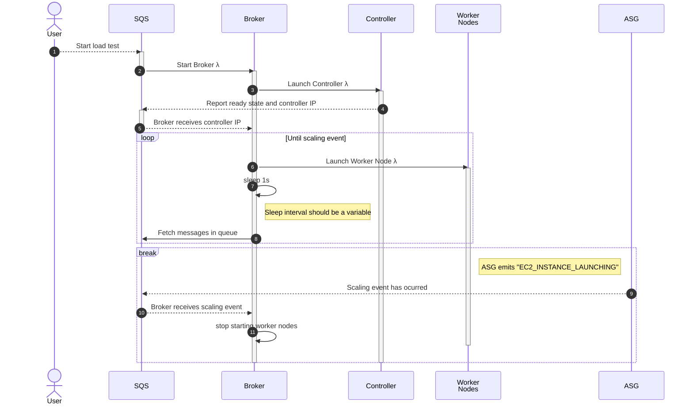

```mermaid
sequenceDiagram
    autonumber
    actor u as User
    participant sqs as SQS
    participant b as Broker
    participant c as Controller
    participant n AS Worker<br />Nodes
    participant asg as ASG
    u -->> sqs: Start load test
    activate sqs
    sqs ->> b: Start Broker #lambda;
    deactivate sqs
    activate b
    b ->> c: Launch Controller #lambda;
    activate c
    c -->> sqs: Report ready state and controller IP
    activate sqs
    sqs -->> b: Broker receives controller IP
    deactivate sqs
    loop Until scaling event
        b ->> n: Launch Worker Node #lambda;
        activate n
        b ->> b: sleep 1s
        Note right of b: Sleep interval should be a variable
        b ->> sqs: Fetch messages in queue
    end
    break
        Note left of asg: ASG emits "EC2_INSTANCE_LAUNCHING"
        asg -->> sqs: Scaling event has ocurred
        sqs -->> b: Broker receives scaling event
        b ->> b: stop starting worker nodes
        deactivate n
    end
    deactivate c
    deactivate b
```
