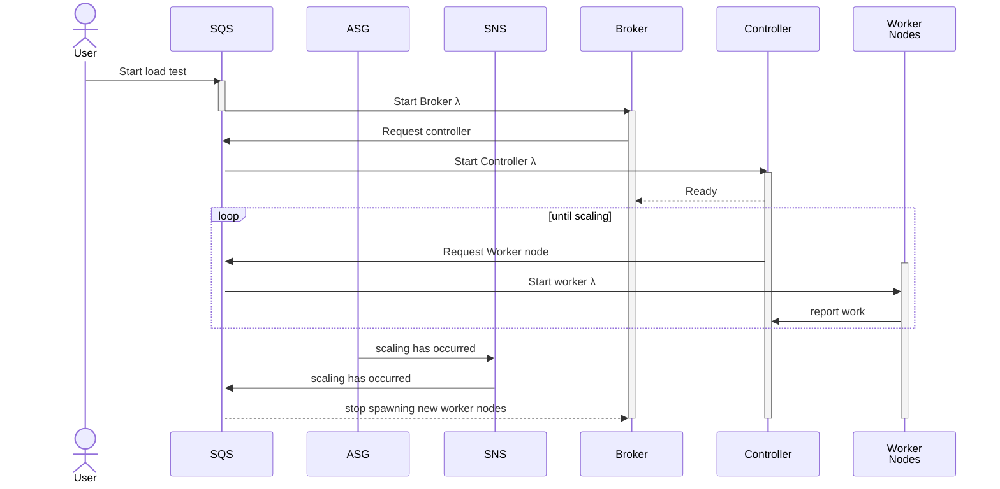

```mermaid
sequenceDiagram
    actor u as User
    participant sqs as SQS
    participant asg as ASG
    participant sns as SNS
    participant b as Broker
    participant c as Controller
    participant n AS Worker<br />Nodes
    u ->> sqs: Start load test
    activate sqs
    sqs ->> b: Start Broker #lambda;
    deactivate sqs
    activate b
    b ->> sqs: Request controller
    activate sqs
    sqs ->> c: Start Controller #lambda;
    activate c
    c -->> b: Ready
    loop until scaling
        c ->> sqs: Request Worker node
        activate n
        sqs ->> n: Start worker #lambda;
        n ->> c: report work
    end
    asg ->> sns: scaling has occurred
    sns ->> sqs: scaling has occurred
    sqs -->> b: stop spawning new worker nodes
    deactivate n
    deactivate c
    deactivate b
```
