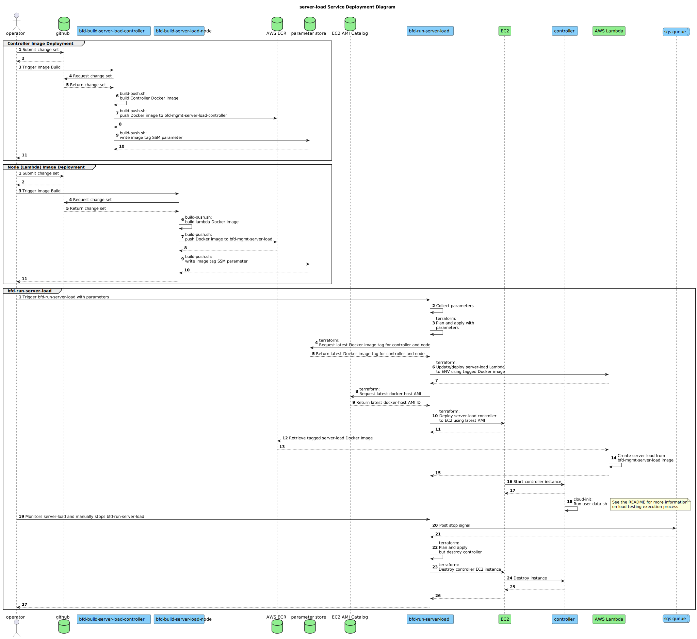

# `bfd-run-server-load`/`bfd-server-load` Service

## Service Diagram

## Service Overview

This sub-directory contains the source code for the `bfd-run-server-load` Jenkins job that is
capable of running many different load testing scenarios, such as:

- Load tests that ramp up infinitely until a scaling event
  - The number of instances in the scaling group to target is configurable
- Static load tests that run with a set number of users for a set period of time ignoring scaling
  events
- And more...

The flexibility allows for an engineer to modify parameters and see how the BFD Server performs
under the load conditions provided. In all, the following parameters can be modified:

- SDLC Environment
- The host to test
- The number of _initial_ worker **nodes**/Lambdas (_not_ simulated users) to start with before the
  Locust master starts
- The amount of time to wait between spawning nodes/Lambdas
- The maximum number of nodes/Lambdas to spawn
- The maximum number of _simulated users_ for **Locust** to spawn
  - This controls the load actually generated on the target
  - In general, a ratio of 10:1 (10 users to 1 node/lambda) should be followed for the best
    performance
- The spawn rate of _simulated users_ in number of users per second
- The test runtime limit
  - This is used as a safeguard to ensure that runaway load testing does not occur
  - Separate from the Lambda runtime limit
- The amount of time to "coast" after a scaling event was encountered
  - Allows for testing the performance during and immediately after scaling
  - Set to `0` if the amount of load required to scale (and nothing more) is desired
- The target number of instances that have been scaled up to before load testing stops
- Whether to stop when a scaling event is encountered
- Whether to stop when the node/Lambda limit is reached or not
  - Use this as a safeguard against runway Lambda spawning during non-static load tests

By default, _for the Jenkins job_, these parameters are set to values that will continue to ramp up
the test until a scaling event is encountered at which point the test will "coast" for 10 seconds
and stop.

Note that builds/runs of this pipeline _do not_ communicate with the controller directly. The
operator is required to indicate when the load test has finished (or allow the built-in timeout to
lapse).

The statistics and logs generated from a load test run are made available in CloudWatch in realtime,
under the following log groups with each log stream being the instance ID it was gathered from:

- /bfd/{env}/bfd-server-load/server-load-controller.log
- /bfd/{env}/bfd-server-load/load_exceptions.csv
- /bfd/{env}/bfd-server-load/load_failures.csv
- /bfd/{env}/bfd-server-load/load_stats.csv
- /bfd/{env}/bfd-server-load/load_stats_history.csv

This service is built to be as safe as possible, having a variety of safeguards built-in to ensure
that unintended or runaway load testing does not occur:

- A hardcoded "stop signal" is constantly polled for. If encountered, all nodes _and_ the controller
  stop immediately
- When the controller stops, it unconditionally sends a stop signal to ensure nodes stop as well
- When the Jenkins pipeline build ends, it sends a stop signal to ensure that the controller and
  nodes stop
- When the Jenkins pipeline build ends, the controller instance is immediately destroyed
- At any time an operator can opt to abort the Jenkins pipeline build causing the above safeguards
  to fire
- A default timeout of `TEST_RUNTIME_LIMIT` plus 10 minutes will stop the Jenkins build
  automatically if there is no user interaction during that time
- The default parameters _excluding the Jenkins job itself_ are set to values that will immediately
  stop the test if not overridden
