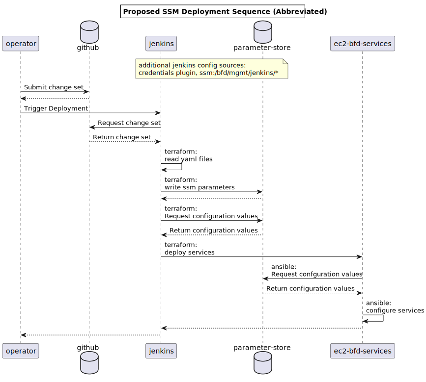

# RFC Proposal
[RFC Proposal]: #rfc-proposal

* RFC Proposal ID: `0015-centralized-configuration-management`
* Start Date: 2022-07-05
* RFC PR: [beneficiary-fhir-data/rfcs#0015](https://github.com/CMSgov/beneficiary-fhir-data/pull/1193)
* JIRA Ticket(s):
    * [BFD-1641](https://jira.cms.gov/browse/BFD-1641)

This RFC proposes BFD's adoption of:
- AWS Systems Manager (SSM) Parameter Store as the primary method for managing environment and system-specific configuration
- A set of conventions to dramatically improve the strategy for storing and supplying configuration to BFD services and supporting systems

## Status
[Status]: #status

* Status: Implemented
* Implementation JIRA Ticket(s):
    * [BFD-1639](https://jira.cms.gov/browse/BFD-1639)

## Table of Contents
[Table of Contents]: #table-of-contents

* [RFC Proposal](#rfc-proposal)
* [Status](#status)
* [Table of Contents](#table-of-contents)
* [Motivation](#motivation)
* [Proposed Solution](#proposed-solution)
    * [Proposed Solution: Detailed Design](#proposed-solution-detailed-design)
    * [Proposed Solution: Unresolved Questions](#proposed-solution-unresolved-questions)
    * [Proposed Solution: Drawbacks](#proposed-solution-drawbacks)
    * [Proposed Solution: Notable Alternatives](#proposed-solution-notable-alternatives)
* [Prior Art](#prior-art)
* [Future Possibilities](#future-possibilities)
* [Addendums](#addendums)

## Motivation
[Motivation]: #motivation

Despite BFD's relatively modest infrastructure footprint, the existing configuration strategy is complex.
How, where, and _when_ configuration is used informs us of the tools and locations of supporting code that may need to be updated to accommodate a change.
Supported use-cases like renaming or adding new configuration may require one or more updates to the following locations:

1. packer definitions
2. sensitive ansible variables protected with `ansible-vault`
3. nonsensitive ansible variables in plain-text
4. ansible build playbooks
5. ansible launch playbooks
6. ansible role variables
7. ansible role definitions
8. sensitive terraform input variables stored as tfvars files in `keybase`
9. nonsensitive terraform input variables passed between Jenkins job stages
10. terraform templated cloud-init user data definitions
11. terraform module definitions
12. nonsensitive Jenkins job definitions stored in Jenkins
13. nonsensitive Jenkins job definitions stored in various Jenkinsfiles
14. sensitive Jenkins definitions stored with the Jenkins credential plugin

The ability to supply configuration to each tool should be an enabling feature.
Instead, the sprawling configuration has historically discouraged us from adopting worthy changes, contributed to operators' inadvertent addition of errors, and represents an unfriendly introduction to new contributors who wish to make what would otherwise be simple updates to BFD configuration.

## Proposed Solution
[Proposed Solution]: #proposed-solution

AWS Systems Manager (SSM) Parameter Store is a hierarchical, key-value data store typically used for centrally managed sensitive and nonsensitive configuration data.
In addition to the AWS Console, the Parameter Store is accessed through the Parameter Store API, and can be even more accessible through various tools, including:
- the AWS CLI via `aws ssm` ([single parameter](https://docs.aws.amazon.com/cli/latest/reference/ssm/get-parameter.html) and [path lookups](https://docs.aws.amazon.com/cli/latest/reference/ssm/get-parameters-by-path.html)) sub-command
- terraform resources and data sources ([single parameter](https://registry.terraform.io/providers/hashicorp/aws/latest/docs/data-sources/ssm_parameter) and [path lookups](https://registry.terraform.io/providers/hashicorp/aws/latest/docs/data-sources/ssm_parameters_by_path)) with the aws provider
- ansible workflows through the [`aws_ssm` lookup plugin](https://docs.ansible.com/ansible/2.9/plugins/lookup/aws_ssm.html)

### Parameter Formatting

We take advantage of Parameter Store's hierarchical nature by formatting the hierarchies into 4-tuple prefixes, culminating in a named _leaf_ node. Together, the 4-tuple prefix and leaf make up a single parameter: `/${project}/${env}/${group}/${sensitivity}/${leaf}`.
Each member of the tuple represents a scoped level or tier providing increasingly specific context for BFD services and supporting systems.
The scopes lend themselves well to crafting simple queries and tailored access policies that target the necessary hierarchies of configuration data only.
The primary use cases for these parameters include infrastructure-as-code, automated-configuration-management, and release-management strategies in `terraform`, `ansible`, and `jenkins` tooling, respectively.
This proposed format **does not** apply to other potential Parameter Store use-cases.

### Project Scope

Project scope (`${project}`) is the _parameter name root_. In these hierarchies, this is *practically* an invariant that resolves to our project: `bfd`.
Nevertheless, this is necessary to separate bfd-specific resources from other potential hierarchies managed by external teams supporting wider CMS projects.

#### Conventions

- No leaves are allowed within this scope, e.g. `/bfd/foo` is illegal
- Must resolve to `bfd`

### Environment Scope

Environment scope (`${env}`) includes typical Software Development Life Cycle (SDLC) Environments like production (`prod`), those used along the *path-to-production* like `test` and `prod-sbx`, as well as higher order environments that fall outside of the typical BFD release process, i.e. `mgmt`.
This fundamental scope separates production hierarchies from non-production ones and facilitates simple, least-privilege role-based access controls for developers and services.

#### Conventions

- No leaf nodes are allowed within this scope, e.g. `/bfd/prod/foo` is illegal
- Must be one of `mgmt`, `prod`, `prod-sbx`, or `test`

#### Examples

- `/bfd/mgmt/`
- `/bfd/prod/`
- `/bfd/prod-sbx/`
- `/bfd/test/`

### Group Scope

Group scope (`${group}`) largely provides the service-level configuration. The more inclusive *group* concept is used instead of *service* because hierarchies may include scopes that don't map to any one service.

#### Conventions

- No leaf nodes are allowed within this scope, e.g. `/bfd/test/common/foo` is illegal
- Must be one of `jenkins`, `common`, `migrator`, `pipeline`, or `server`

#### Examples

- `/bfd/mgmt/jenkins/`
- `/bfd/prod-sbx/migrator/`
- `/bfd/prod/server/`
- `/bfd/test/common/`

### Sensitivity Scope and the Leaf Node

Sensitivity scope (`${sensitivity}`) defines whether a leaf node (`${leaf}`) in the hierarchy is stored as an ordinary `String` or encrypted with AWS KMS as a `SecureString`.
Explicit inclusion of this scope keeps secrets handling and access obvious and simple.

The leaf node is the final member of the hierarchy and maps to the configuration value.

#### Conventions

- `${leaf}` must be unique per hierarchy, formatted as lower\_snake\_case, and generally be translatable/consumable as posix shell variable
- Sensitive parameters must be stored under a `sensitive` hierarchy in order to be encrypted as appropriate
- Nonsensitive parameters must be stored under the `nonsensitive` hierarchy to remain in plain-text

#### Examples

- Sensitive Parameters
  - `/bfd/mgmt/jenkins/sensitive/bfd_aws_account_id`
  - `/bfd/test/common/sensitive/rds_master_password`
- Nonsensitive Parameters
  - `/bfd/test/common/nonsensitive/rds_cluster_id`
  - `/bfd/prod-sbx/migrator/nonsensitive/instance_type`
  - `/bfd/test/pipeline/nonsensitive/rda_job_enabled`
  - `/bfd/prod/server/nonsensitive/new_relic_app_name`

### Proposed Solution: Detailed Design
[Proposed Solution: Detailed Design]: #proposed-solution-detailed-design

#### Base Environment Definitions in Terraform

The SDLC environment hierarchies are managed by a terraform module responsible for the base definition of each environment
Environments that fall outside of the typical BFD SDLC process are managed similarly, but because the configuration in e.g. the `mgmt` environment has a wider, more global impact, values defined _there_ may be consumed here to inform the deployment process
Necessarily, they're managed externally to this process.

The parameters are organized in two different, ultimately yaml-encoded files.
Similar to the existing `ansible-vault` strategy, each hierarchy has encrypted and plaint-text variants for sensitive and nonsensitive values, respectively.
Each file is named for its environment under a `./values` directory.
The parameters are encoded as key:value mappings of fully-qualified SSM Parameter Name keys to Parameter values.

```yaml
# from notional ./values/test.yaml
--- 
/bfd/test/common/nonsensitive/env_name_std: test
# [..snipped..]
```

The terraform-workspace enabled module derives the environment name from the workspace.
For the `test` environment and `test` workspace, terraform finds `.values/test.eyaml` and `.values/test.yaml` for sensitive and nonsensitive values, respectively.

For nonsensitive values exclusively stored in `.values/test.yaml`, terraform decodes the yaml and produces SSM Parameters.

```hcl
# from notional ./main.tf
# [..snipped..]

locals {
  env          = terraform.workspace
  nonsensitive = yamldecode(file("${path.module}/values/${local.env}.yaml")
# [..snipped..]
}

resource "aws_ssm_parameter" "nonsensitive" {
  for_each = local.nonsensitive
  name     = each.key
  type     = "String"
  value    = each.value
}
# [..snipped..]
```

For sensitive values exclusively stored in `.values/test.eyaml`, terraform relies on a script stored in `./scripts/read-and-decrypt-eyaml.sh` for in-process decryption.
In turn, this script is used by an [External Provider](https://registry.terraform.io/providers/hashicorp/external/latest/docs/data-sources/data_source) data source `data.external.sensitive`.

Of course, the implementation details of `read-and-decrypt-eyaml.sh` depend on the encryption mechanism.
For now, a decryption script that uses the existing `ansible-vault` strategy is not complicated, but it's not immediately obvious, either.
The `read-and-decrypt-eyaml.sh` can be broken down into two steps:

1. decrypt using `ansible-vault decrypt --output -` to pass data process-to-process
2. format the yaml as json for the external provider by piping data to `yq eval -o=j`

Terraform iterates over this well-formatted sensitive data as `data.external.sensitive.result` and creates the appropriate SSM Parameters.

```hcl
# from notional ./main.tf
# [..snipped..]

data "external" "sensitive" {
  program = ["${path.module}/scripts/read-and-decrypt-eyaml.sh, "${localenv}.eyaml"]
}

resource "aws_ssm_parameter" "sensitive" {
  for_each = data.external.sensitive.result
  type     = "SecureString"
  name     = each.key
  value    = each.value
}
```

The process for introducing or updating values is mainly CI-driven, with Jenkins supporting a new stage responsible for defining *or* redefining the base environment.
The nonsensitive value updates are intuitive, requiring adjustments to the values in-place under plain-text yaml files.
While `ansible-vault` remains the encryption mechanism, updating encrypted values remains a familiar process of fetching the encryption password, decrypting via e.g. `ansible edit`, and making necessary updates. 

Though a CI process is involved, the terraform module cooperates with some temporary, exceptional use-cases, such as those involving extra-terraform or manual, out-of-band changes.
For nonsensitive values, this module supports temporary overrides and additional configuration.
Further, this uses an `aws.ssm_parameters_by_path` data source to query nonsensitive hierarchies for the given environment.
In so doing, it captures the state of the all parameters in the hierarchy for visibility.
Together, the queried SSM hierarchies, environmental yaml, and any locally-defined overrides are merged to create a simple low, medium, high precedence, respectively.

The happy path is depicted in the following sequence diagram:



#### Access Controls

This solution manages both sensitive and nonsensitive values. This has a few areas concerning access control:
1. AWS SSM Access
  - General __write_ access to AWS SSM Parameter Store
  - Read access to sensitive values under `arn:aws:ssm:us-east-1:${bfd_account_id}:parameter/bfd/*/*/sensitive/*`
2. AWS Key Management Service (KMS) Access
  - policies for encryption and parameter store write access
  - policies for decryption and parameter store read access
3. AWS S3 Access
  - Specific access to terraform tfstate file under `s3://bfd-tf-state/env:/*/services/base/`

##### AWS SSM Access

Services in each environment are able to read from the nonsensitive common hierarchy as well as their respective group hierarchy.

| ssm policy                     | access | resources                                                     | usage         |
|:-------------------------------|:-------|:--------------------------------------------------------------|---------------|
| `bfd-${env}-migrator-ssm-read` | read   | `/bfd/${env}/common/nonsensitive/*`, `/bfd/${env}/migrator/*` | migrator role |
| `bfd-${env}-pipeline-ssm-read` | read   | `/bfd/${env}/common/nonsensitive/*`, `/bfd/${env}/pipeline/*` | pipeline role |
| `bfd-${env}-server-ssm-read`   | read   | `/bfd/${env}/common/nonsensitive/*`, `/bfd/${env}/server/*`   | server role   |

Jenkins and BFD Engineers have wider, cross environment access in addition to write permissions:

| ssm policy               | access | resources | usage                      |
|:-------------------------|:-------|:----------|:---------------------------|
| `bfd-mgmt-bfd-ssm-read`  | read   | `/bfd/*`  | jenkins, engineers         |
| `bfd-mgmt-bfd-ssm-write` | write  | `/bfd/*`  | jenkins, on-call engineers |

##### KMS Access

Re-iterating the above, each parameter including a sensitive value, e.g. `/bfd/*/*/sensitive/*`, is stored as a `SecureString`.
These values are encrypted by the appropriate Customer Managed Key.
As result, personas regularly reading _or_ writing sensitive hierarchies also require decrypt and encrypt permissions to each key at issue.

##### Terraform tfstate

Access not just to *this* tfstate file, used by the base environment definition, but any tfstate file that uses a sensitive value in pursuing infrastructure-level changes needs to be restricted to personas executing terraform.

#### Adoption and Parameter Precedence

So long as the configuration strategy for a given group or service is consistent across environments, even partial adoption of AWS SSM Parameter Store provides value.
However, to reduce confusion and potential complexity, once we've started the process of transitioning, we endeavor to complete the transition as quickly as feasible.

For this solution's adoption and implementation to be most obvious, we must have a clear stance on hierarchical configuration data and precedence at the tool level.
This is especially important for `ansible` with its [support for >20 levels of _variable precedence_](https://docs.ansible.com/ansible/latest/user_guide/playbooks_variables.html#variable-precedence-where-should-i-put-a-variable) as well as `terraform` where we have an number of required input variables.
The desired end state is thus: **automation tools and their respective configuration data are primarily informed by values derived from AWS SSM Parameter Store.**
This entails that this configuration strategy will have the following characteristics when fully implemented:
- `ansible`: variables files defined as defaults in roles or variable files in playbooks no longer exist
- `terraform`: required, non-null terraform variables are used only by exception

### Proposed Solution: Unresolved Questions
[Proposed Solution: Unresolved Questions]: #proposed-solution-unresolved-questions

N/A

### Proposed Solution: Drawbacks
[Proposed Solution: Drawbacks]: #proposed-solution-drawbacks

- This solution continues to rely on `ansible-vault` as the encryption mechanism, which has known limitations.

### Proposed Solution: Notable Alternatives
[Proposed Solution: Notable Alternatives]: #proposed-solution-notable-alternatives

#### AWS SSM AppConfig

[AWS Systems Manager AppConfig](https://docs.aws.amazon.com/systems-manager/latest/userguide/appconfig.html) could be the next logical step in managing configuration, but adoption would mean less augmentation of the existing system and more replacement.

Unlike Parameter Store where resources are single, configuration values stored as parameters, AppConfig's approach is more holistic with awareness and storage of whole configurations for applications across SDLC environments.
It provides more sophistication surrounding validating application configuration and facilitates deployments when configurations are updated.
AppConfig is an especially helpful service when configuration is highly dynamic with liberal use of feature flags.
However, unlike Parameter Store, adopting AppConfig is a deeper investment into AWS Systems Manager and may require changes at the application-level to fully enable AppConfig.

#### HashiCorp Vault+Consul

[Vault by Hashicorp](https://www.vaultproject.io/), is a non-starter due to the cost associated with the solution, be it self-managed or third-party management.

Along with [Consul](https://www.consul.io/) as part of [the reference Architecture](https://learn.hashicorp.com/tutorials/vault/reference-architecture), a Vault+Consul strategy has a number of overlapping features with the proposed strategy.
Because it supports a variety of authentication methods and secrets engines, the combination can be fashioned to be a near drop-in replacement for AWS SSM Parameter Store.
However, unlike AWS SSM Parameter Store, this requires additional managed infrastructure or cost for third-party management of that infrastructure.
The effort involved in self-managing a highly-available, secure system like this may rival the complexity in managing the existing BFD systems.
Beyond the maintenance, the infrastructure footprint would require _at least_ three EC2 instances for Vault and at least three nodes for Consul.
While hourly billing for a production-worthy, managed HashiCorp Cloud Platform offering, pricing starts at $1.578/hr.
In both cases, unlike usage-based pricing in AWS SSM Parameter Store, we'd be paying for the infrastructure or the management of the infrastructure, regardless of utilization.

## Prior Art
[Prior Art]: #prior-art

N/A

## Future Possibilities
[Future Possibilities]: #future-possibilities

### Ergonomic Encryption Mechanism

We might consider adopting something like `hiera-eyaml` and `hiera-eyaml-kms` for encrypting and decrypting configuration values.

This solution initially proposes the continued use of the existing `ansible-vault` for securing values in VCS.
This isn't very ergonomic and it continues to represent a maintenance burden for the team in a few different ways:
1. values are encrypted at the file level resulting in less meaningful change set diffs
2. encrypt and decrypt functions requires a password in plain-text
3. password requires rotation after certain personnel changes
4. generally, access control for an encryption password is problematic
  - it's difficult to answer who has access to the password
  - it's impossible to know when files have been decrypted with the password
  - onboarding engineers requires multiple steps

We turn to the wider industry in configuration management to search for similar tools that might solve the challenges that motivated _this_ RFC.
In doing so, we re-discover that [Puppet](https://puppet.com) does.
Through its explicit separation of configuration logic (written in puppet) from its _hierarchical_ configuration data or _[Hiera](https://puppet.com/docs/puppet/7/hiera.html)_, Puppet strongly support code re-use.

Hiera is a complex, Puppet-specific, pluggable software system that supports a variety of merge strategies for hiera data, helping operators apply relevant configuration hierarchies from the widest global contexts to the narrowest individual node-level contexts, and anything in between.
Historically, the separation of hiera data from puppet code meant physical separation from the puppet code base, often outside of VCS all together.
When savvier operators used VCS (or delivery teams adopted _DevOps_), they were forced to make a choice: accept sensitive data in their repository, support an alternative strategy for incorporating sensitive values out-of-band, or adopt a hiera backend like [`hiera-gpg`](https://github.com/crayfishx/hiera-gpg) for encryption and decryption.

The `hiera-gpg` strategy moved operations in a positive direction, allowing teams to secure sensitive data with GPG keys.
However, It's not without its own challenges, some of which are the same that face BFD today with our usage of `ansible-vault`.
For those using puppet, things have gotten better with `hiera-eyaml`.

[`hiera-eyaml`](https://github.com/voxpupuli/hiera-eyaml) is a _pluggable_, software system that extends Hiera.
By default, it supports encryption using general PKCS7 certificates.
While it's ostensibly supported by the [VoxPupuli](https://voxpupuli.org/) Puppet Community, it's the de facto standard for handling sensitive hiera data with Puppet.
It enjoys some degree of first-party support from Puppet with both VoxPupuli and `hiera-eyaml` appearing in Puppet's official documentation.
For our use, `hiera-eyaml` provides a general-purpose command line interface utility that supports field-level encryption of yaml files, which makes commit diffs much more meaningful.
What's more, the `hiera-eyaml-kms` plugin allows operators to use keys stored in AWS KMS which have role based access control provided by Key and IAM policies.

### Future Automation Opportunities

We could consider adopting more AWS Systems Manager services to all but eliminate the lengthy deployments that only consist of configuration changes.

Today, automation in BFD infrastructure is informed by an immutable pattern, which _generally_ requires deploying new artifacts for even the most basic configuration changes.
(It's important to note that a critical aspect of this strategy isn't as immutable as advertised: logic and configuration values in ansible are **not** part of the artifact)

This pattern has been fairly successful.
By effectively providing a single, happy path for change management along the path-to-production, it's simple to answer the question: "How do we get that change in?"
You just rebuild and redeploy **everything**.
The resources used in pursuing this strategy are quite modest, too.
It's really just a single, build-deploy pipeline in Jenkins that does all the things.
We're not supporting long-living instances that need to abide by patching cadence.
No [ansible tower](https://docs.ansible.com/ansible/2.3/tower.html) or similar with this strategy, and the maintenance thereof.
BFD's orchestration needs are few.

However, for exceptional use-cases, especially during incident response, this can be a frustrating process.
Again, this would have operators rebuild and redeploy **everything**, even for a single line, configuration change.
The appeal of out-of-band (OOB) changes is undeniable under these circumstances.
While this process doesn't make those exceptional OOB changes any harder, it doesn't make them any easier, either. 
- reconstructing the time line for incident response when OOB changes are involved can be difficult
- communicating while engaged in high-touch OOB change can be distracting and lead to errors
- operators need to ensure they avoid other automation that might undo their change
- sometimes, we forget to encode changes made this way into the enduring automation
- OOB changes can temporary, but may persist well after the incident is considered resolved

With AWS SSM Parameter Store engaged, we may be able to optimize for the OOB updates and make them more attractive to be done in a more observable, automated way.
Using something like AWS SSM Documents, AWS SSM Run Command, and signaling via AWS EventBridge, we could craft automated routines to run on changes to specific parameters in AWS SSM Parameter Store.
Another area of investigation would be incorporation of AWS SSM AppConfig, potentially a logical next step in configuration management for BFD.

## Addendums
[Addendums]: #addendums

The following addendums are required reading before voting on this proposal:

* [AWS Naming and Tagging Conventions](https://confluence.cms.gov/pages/viewpage.action?spaceKey=ODI&title=AWS+Naming+and+Tagging+Conventions)

Please note that some of these addendums may be encrypted. If you are unable to decrypt the files, you are not authorized to vote on this proposal.
