# RFC Proposal

* RFC Proposal ID: `0023-samhsa-v2`
* Start Date: 2024-10-11
* RFC PR: [beneficiary-fhir-data/rfcs#0023](https://github.com/CMSgov/beneficiary-fhir-data/pull/2464)
* JIRA Ticket(s):
    * [BFD-3660](https://jira.cms.gov/browse/BFD-3660)

A proposal to rewrite the SAMHSA filter to be more reliable and easier to maintain.

## Status

* Status: Proposed <!-- (Proposed/Approved/Rejected/Implemented) -->
* Implementation JIRA Ticket(s):

## Table of Contents

- [RFC Proposal](#rfc-proposal)
  - [Status](#status)
  - [Table of Contents](#table-of-contents)
  - [Background](#background)
  - [Implementation Overview](#implementation-overview)
  - [Database Schema](#database-schema)
    - [Optional Addition: Claim Details](#optional-addition-claim-details)
    - [Entity Definitions - DSL vs JPA](#entity-definitions---dsl-vs-jpa)
  - [Pipeline Updates](#pipeline-updates)
  - [FHIR Server Updates](#fhir-server-updates)

## Background

The SAMHSA filter currently operates on the transformed representation of the FHIR payloads.
It looks at the diagnosis, procedure, and detail components of the payload and checks the list of ICD, CPT, and DRG codes. 
When `excludeSAMHSA=true` is supplied to the EOB, Claim, or ClaimResponse endpoints, any claim that contains at least one code that matches against the SAMHSA list will be excluded.

The current filter logic is tightly coupled to the implementation of the FHIR transformers.
Any change to the system URLs, additional functionality that adds a potentially sensitive code to a new field in the FHIR response, or a bug that causes certain fields to not be mapped in the FHIR payload may cause the filter to behave incorrectly. 

Instead of basing the SAMHSA filter on the FHIR payload, it would be safer to check any database column that could contain sensitive info and explicitly mark that claim as sensitive at ingestion time.

## Implementation Overview

The implementation will utilize [FHIR Security Labels](https://hl7.org/fhir/R4/security-labels.html) to tag claims as 'sensitive'.
SAMHSA claims will include a [Confidentiality](https://terminology.hl7.org/5.5.0/CodeSystem-v3-Confidentiality.html#v3-Confidentiality-R) tag of `R` for 'restricted' and an [Act Code](https://terminology.hl7.org/5.5.0/CodeSystem-v3-ActCode.html#v3-ActCode-42CFRPart2CD) tag of `42CFRPart2`.
Non-SAMHSA claims will include a Confidentiality tag of `N` (normal).

These tags will be stored in the database using a new set of tables.
The usage of these tags can be extended beyond just SAMHSA data in the future.

## Database Schema

The tag values themselves can be stored as a Postgres enum:

```sql
CREATE TYPE tag_code AS ENUM('R', '42CFRPart2');
```

We include the tags for sensitive data, but not the one for normal claims (`N`) since any claim not flagged as sensitive can assumed to be normal.
This prevents us from storing an extra tag for every single claim in the database.

Each claim table will have a corresponding table that will store the associated tags.

Each SAMHSA claim will have two corresponding rows in the tags table. Ex:

| tag_id | clm_id | code       |
| ------ | ------ | ---------- |
| 1      | 1000   | R          |
| 2      | 1000   | 42CFRPart2 |

```mermaid
erDiagram
    "ccw.carrier_claims" {
        clm_id BIGINT
    }

    "ccw.dme_claims" {
        clm_id BIGINT
    }

    "ccw.hha_claims" {
        clm_id BIGINT
    }

    "ccw.hospice_claims" {
        clm_id BIGINT
    }

    "ccw.inpatient_claims" {
        clm_id BIGINT
    }

    "ccw.outpatient_claims" {
        clm_id BIGINT
    }

    "ccw.carrier_tags" {
        tag_id BIGINT
        clm_id BIGINT
        code Enum "Enum(R, 42CFRPart2)"
    }

     "ccw.dme_tags" {
        tag_id BIGINT
        clm_id BIGINT
        code Enum "Enum(R, 42CFRPart2)"
    }

     "ccw.hha_tags" {
        tag_id BIGINT
        clm_id BIGINT
        code Enum "Enum(R, 42CFRPart2)"
    }

     "ccw.hospice_tags" {
        tag_id BIGINT
        clm_id BIGINT
        code Enum "Enum(R, 42CFRPart2)"
    }
    
    "ccw.inpatient_tags" {
        tag_id BIGINT
        clm_id BIGINT
        code Enum "Enum(R, 42CFRPart2)"
    }

    "ccw.outpatient_tags" {
        tag_id BIGINT
        clm_id BIGINT
        code Enum "Enum(R, 42CFRPart2)"
    }
    
    "rda.fiss_claims" {
        claim_id VARCHAR
    }

    "rda.mcs_claims" {
        idr_clm_hd_icn VARCHAR
    }
    
    "rda.fiss_tags" {
        tag_id BIGINT
        claim_id VARCHAR
        code Enum "{R, 42CFRPart2}"
    }

    "rda.mcs_tags" {
        tag_id BIGINT
        idr_clm_hd_icn VARCHAR
        code Enum "{R, 42CFRPart2}"
    }

    "ccw.carrier_claims" ||--o{ "ccw.carrier_tags": ""
    "ccw.dme_claims" ||--o{ "ccw.dme_tags": ""
    "ccw.hha_claims" ||--o{ "ccw.hha_tags": ""
    "ccw.hospice_claims" ||--o{ "ccw.hospice_tags": ""
    "ccw.inpatient_claims" ||--o{ "ccw.inpatient_tags": ""
    "ccw.outpatient_claims" ||--o{ "ccw.outpatient_tags": ""
    "rda.fiss_claims" ||--o{ "rda.fiss_tags": ""
    "rda.mcs_claims" ||--o{ "rda.mcs_tags": ""
```



### Optional Addition: Claim Details

We have no requirement to return which specific field in the claim contains SAMHSA data.
However, it may be useful to track this information for observability purposes.
To do so, we can include a `JSONB` column on the tags table to store any additional information that may be useful for engineers to look at.

JSONB is useful in this case because the information is not used in the implementation itself, so we can favor flexibility over strictness.


An example `details` field may look like this:

```json
[
    {
        "table": "ccw.inpatient_claims",
        "column": "clm_drg_cd",
        "type": "DRG"
    },
    {
        "table": "ccw.inpatient_claim_lines",
        "column": "hcpcs_cd",
        "clm_line_num": 2,
        "type": "CPT"
    }
]
```

### Entity Definitions - DSL vs JPA

Most of our database tables are generated using the YAML-based DSL.
The DSL takes care of generating the JPA entities and also includes extra logic to handle automatically mapping incoming data from RIF files or protobufs.

The main purpose of the DSL is to make it easy to map incoming data directly into our database tables. However, the tables we're adding for this functionality will be populated using our own logic and don't directly map to the fields coming from the RIF files or RDA messages, so the extra codegen features provided by the DSL are largely unnecessary.
The internal RDA tracking tables (`mbi_cache`, `message_errors`, `rda_api_progress`, and `claim_message_meta_data`) are also defined using JPA entities directly, so there is precedent for this.

## Pipeline Updates

The CCW and RDA pipelines will need to be updated to populate the new tables.
At processing time, the pipeline will check each claim against the configured list of SAMHSA codes and populate the tag tables with both the `R` and `42CFRPart2` tags for each SAMHSA claim.

## FHIR Server Updates

The SQL queries used to fetch the claims data for the EOB, Claim, and ClaimResponse endpoints will need to join against the tag tables in order to determine which claims have SAMHSA data.
SAMHSA claims should not be included if `excludeSAMHSA=true` is supplied in the request. 
The `R` and `42CFRPart2` [Security Labels](https://hl7.org/fhir/R4/security-labels.html) should be applied to the FHIR response if SAMHSA data is allowed to be returned.

The new approach should be fully compatible with the existing filter, therefore we should utilize a feature flag in order to allow both implementations to coexist.
This reduces risk in the event that a defect in the new implementation creates a need to fall back to the current one.
The feature flag and current implementation can be removed at a later time.
