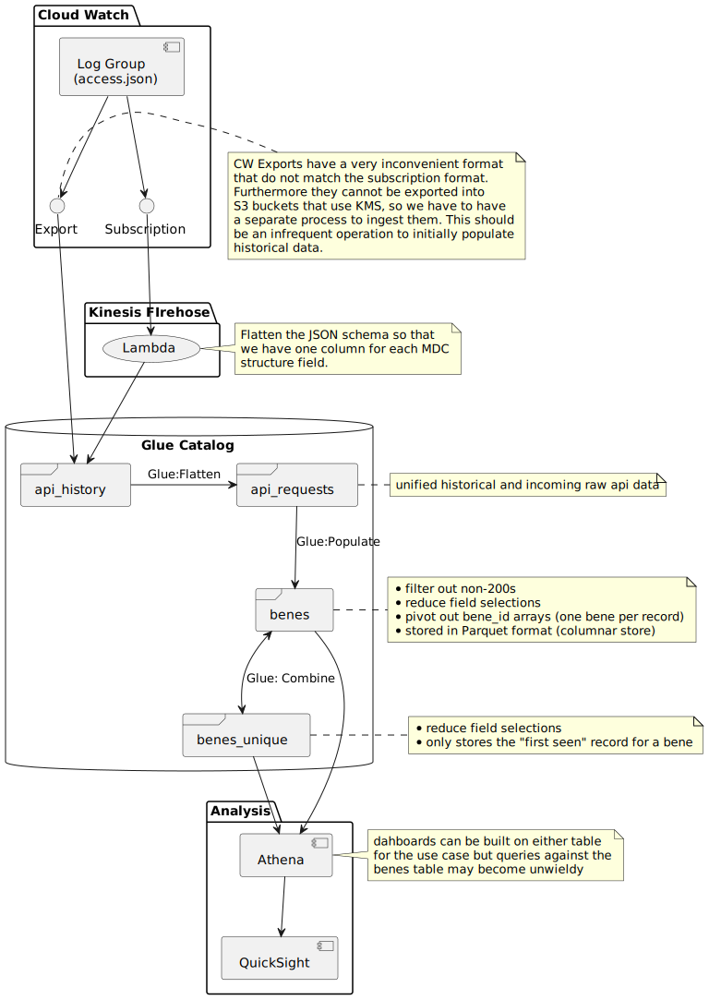
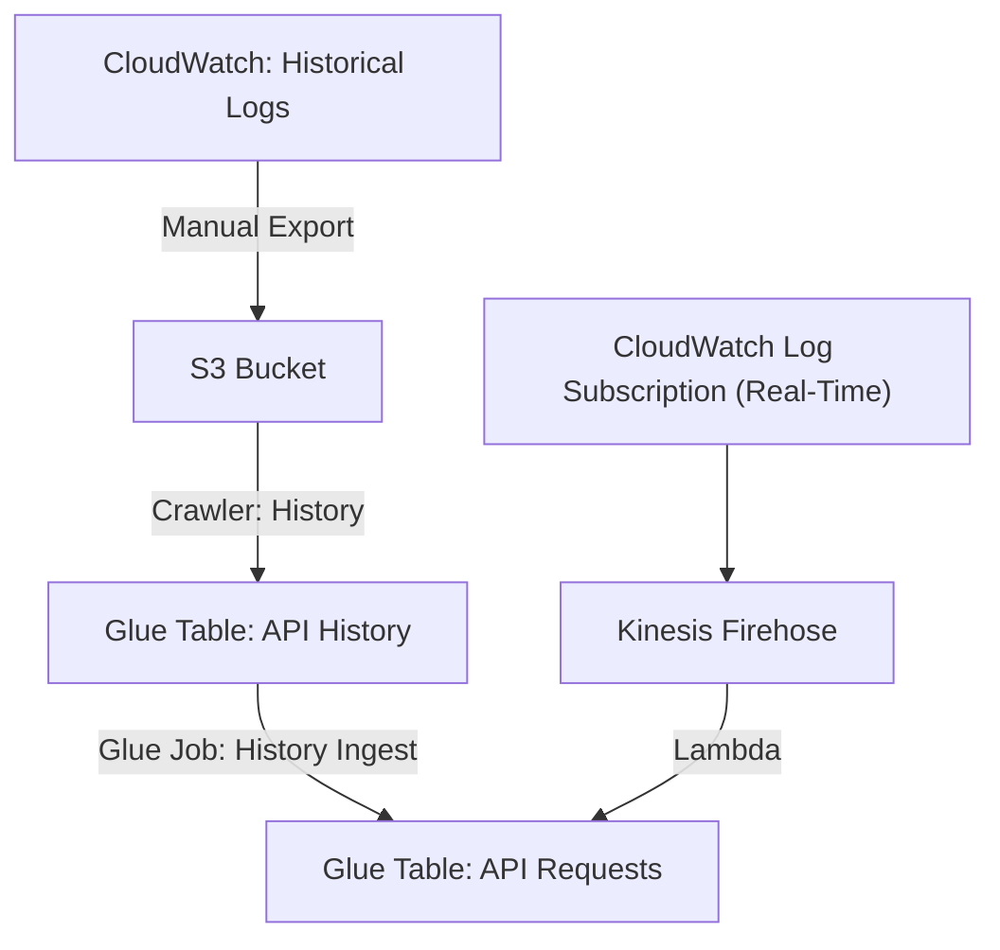
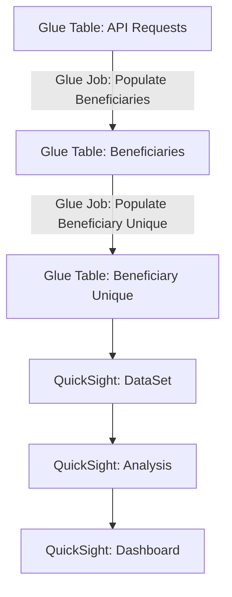

# BFD Insights: BFD Dashboards

BFD Insights captures data in near-real-time from the EC2 instances and provides the data for analysis in QuickSight.

## API-Requests

API-Requests is the portion of the project that ingests the logs and stores them in Glue tables. Normally, this happens in real time through AWS Kinesis Firehose, but it can also be done manually by exporting logs from CloudWatch and running a Glue Job to ingest them into the API-Requests table. Most other parts of this project will depend upon API-Requests.

### Structure

### Manual Ingestion of Log Files

Note: Replace `<environment>` and `<account-number>` with the name of your environment, such as
`prod` or `prod-sbx`, and the AWS account number, respectively.

1. CloudWatch > Log Groups > `/bfd/<environment>/bfd-server/access.json`
    - Actions > Export Data to Amazon S3
        - Choose time period
        - Select Account: *This Account*
        - S3 Bucket Name: `bfd-insights-bfd-app-logs`
        - S3 Bucket Prefix: `history/temp-<environment>`.
    - Export. This took about 80 minutes for 3 weeks of prod-sbx logs.

2. S3
    - Select bucket `bfd-insights-bfd-app-logs`
    - Go to path `history/temp-<environment>`
    - Select all objects *except* `aws-logs-write-test`
    - Actions > Move
        - Bucket
        - Destination: `bfd-insights-bfd-<account-number>/databases/bfd-insights-bfd-<environment>/api_history/`
        - Move

3. AWS Glue > Workflows > `bfd-insights-bfd-<environment>-history-workflow`
    - Actions > Run. The entire workflow may take a bit to run through, but you can track progress in the graph.

## Beneficiaries

Beneficiaries is the portion that selects the beneficiary and timestamp from the API-Requests table. Beneficiaries-Unique (which is included within this portion of BFD Insights) includes the calculations of when each beneficiary was first queried.

### Structure

## Manual Creation of QuickSight Dashboards

Note: Replace `<environment>` with the name of your environment, such as `prod` or `prod-sbx`.

1. Go to [QuickSight](https://us-east-1.quicksight.aws.amazon.com/).
2. Datasets. New Dataset.
    - Athena.
        - Name your data source. Example: `bfd-<environment>-beneficiaries`
        - Athena Workgroup: `bfd`
        - Create Data Source.
    - Choose Your Table.
        - Catalog: `AwsDataCatalog`
        - Database: `bfd-<environment>`
        - Table: Choose the one you want to query. Ex: `bfd-<environment>-beneficiaries`
        - Select.
    - Finish dataset creation.
        - Directly query your data.
        - Visualize.
3. Create an analysis.
    - Under Visual Types (on the left), select `Line Chart`.
    - Expand Field Wells at the top.
    - Drag `# bene_id` from the left to "Value" under the Field Wells.
    - Drag `timestamp` (beneficiaries table) or `last_seen` (beneficiaries_unique table) to the "X Axis" under the Field Wells.
    - In the upper-right, click Share > Publish Dashboard. Choose a name. Example: `bfd-<environment>-beneficiaries`. The default options should be fine, so click Publish Dashboard.
