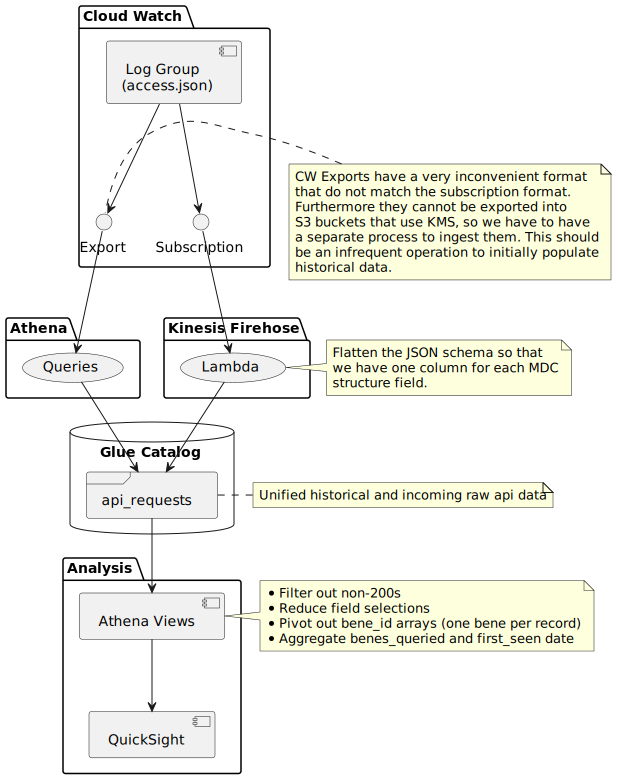
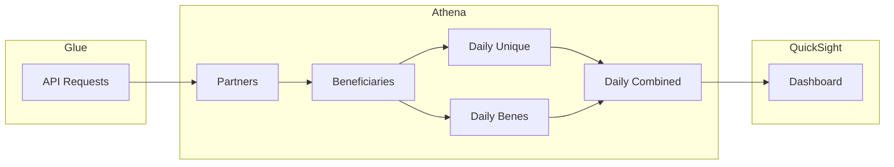

# BFD Insights: BFD Dashboards

BFD Insights captures data in near-real-time from the EC2 instances and provides the data for
analysis in QuickSight.

API-Requests is the portion of the project that ingests the logs and stores them in Glue tables.
Normally, this happens in real time through AWS Kinesis Firehose, but it can also be done manually
by exporting logs from CloudWatch and running a Glue Job to ingest them into the `api_requests`
table. Most other parts of this project will depend upon `api_requests`.





# Naming Conventions

## AWS Resources

Somewhere in the BFD documentation (which I cannot presently find; please update if found), there
was a convention to name AWS resources to clearly identify that the resource belongs to BFD
Insights and to which project (BFD, BB2, AB2D, etc.), plus an identifier for the environment (prod,
prod-sbx, test). The convention is: `bfd-insights-<project>-<environment>-<identifier>` in kebab
case (lower-case words separated by hyphens). The exception is for AWS Glue / Athena table names,
which must be in snake case (lower-case separated by underscores), because the hyphen is not a
valid character in Athena table names. For example, we have
`bfd-insights-bfd-prod-sbx-firehose-ingester` and `bfd-insights-bfd-test-api-requests-crawler`.
However, for Glue Tables, we have `bfd_insights_bfd_prod_sbx_api_requests`.

## Terraform Resources

The terraform resource names do not need to be labeled with the
`bfd-insights-<project>-<environment>-` prefix, because it should be clear from context what project
they belong in, and environment is derived from the workspace. However, we have decided on a naming
convention like `<function>-<identifier>` in kebab case (lower-case words separated by hyphens), so
that even the modules, which do not clearly indicate the type of AWS resource they represent, will
be clear. For example, we have `module.glue-table-api-requests` and
`aws_glue_crawler.glue-crawler-api-requests`.

# Adding new columns

The `api_requests` table has hard-coded column fields, which is unavoidable due to limitations in
Kinesis Firehose's format_conversion feature.

Based on historical log files, this list is meant to contain every field ever used *so far*.
However, when new fields are added to the FHIR server's log files, they will also need to be added
to api-requests/glue.tf and then the tables will need to be updated in AWS. It is perfectly fine
(preferable, maybe) to update the table schema _before_ the changes go live on the FHIR server.

The procedure for adding a new column is:

1. Add the new column to terraform.
2. Run terraform apply.
3. *IMPORTANT*: If you update the schema (such as adding a new column), you also need to be sure to
update the Views in Athena. See below, under Athena Views.
4. To verify that the new column has been added, wait about fifteen minutes to be sure that some
log files have been processed via Kinesis Firehose, and then run a quick Athena query such as these:

```sql
SELECT * FROM "bfd_insights_bfd_prod_daily_combined";
```

OR

```sql
`SELECT "<column>" FROM "bfd_insights_bfd_prod_partners" WHERE "<column>" IS NOT NULL;
```

# Manual Ingestion of Log Files

This process will be done via a series of complex Athena queries, in order to reduce the amount of
AWS Glue we have to perform. This approach is far more cost-effective and faster.

**TODO: Add a reference to the runbook once completed.**

# Analysis

The Analysis section is handled through Athena views and QuickSight dashboards, and is designed to
be efficient and cost-effective.



## Athena Views

Instead of using AWS Glue to build intermediate tables, we use Athena views to standardize data
collection to some degree.

*IMPORTANT NOTES*:
  * You will have to re-create (or otherwise "refresh") each of these views whenever you update the
  underlying table schema for `api-requests` or you will get an error saying that the view is
  stale. You can copy/paste the queries below, or from the editor click "Insert into Editor" on the
  view.
  * The prod version of these Athena views is listed, as that is the only environment on which we
  are presently doing analysis. They will definitely need to be adapted if we choose to use these
  views / QuickSight in other environments.

**TODO**: When terraform supports Athena Views, put these into terraform.

### Partners

Annotate the `api_requests` data with the partner that made the query, based on the SSL client
certificate.

```sql
CREATE OR REPLACE VIEW "bfd_insights_bfd_prod_partners" AS
SELECT
    mdc_bene_id AS benes,
    CASE "mdc_http_access_request_clientssl_dn"
        WHEN 'C=US, CN=dpc.prod.client' then 'dpc'
        WHEN 'C=US,CN=dpc.prod.client' then 'dpc'
        WHEN 'CN=bluebutton-backend-prod-data-server-client-test' then 'bfd_test'
        WHEN 'CN=bcda-prod-client' then 'bcda'
        WHEN 'CN=ab2d-prod-client' then 'ab2d'
        WHEN 'CN=ab2d-prod-validation-client' then 'ab2d_test'
        WHEN 'EMAILADDRESS=ryan@adhocteam.us, CN=BlueButton Root CA, OU=BlueButton on FHIR API Root CA, O=Centers for Medicare and Medicaid Services, L=Baltimore, ST=Maryland, C=US' then 'bb2'
        WHEN '1.2.840.113549.1.9.1=#16117279616e406164686f637465616d2e7573,CN=BlueButton Root CA,OU=BlueButton on FHIR API Root CA,O=Centers for Medicare and Medicaid Services,L=Baltimore,ST=Maryland,C=US' then 'bb2'
        WHEN 'CN=bfd.cms.gov' then 'bfd'
        ELSE 'unknown'
    END AS partner,
    *
FROM "bfd_insights_bfd_prod_api_requests" AS api_requests;
```

### Beneficiaries

Split the beneficiaries by the comma separators, one row per beneficiary.

```sql
CREATE OR REPLACE VIEW "bfd_insights_bfd_prod_beneficiaries" AS
    SELECT
        TRY(CAST(TRIM(bene) as bigint)) as bene,
        "bfd_insights_bfd_prod_partners".*
    FROM "bfd_insights_bfd_prod_partners"
    CROSS JOIN UNNEST(split(benes, ',')) as x(bene);
```

#### Daily Unique

Count the number of beneficiaries _first seen_ on each calendar date.

```sql
CREATE OR REPLACE VIEW "bfd_insights_bfd_prod_daily_unique_benes" AS
    SELECT
        COUNT(*) AS "num_benes",
        "day"
    FROM (
        SELECT 
            "bene",
            DATE_FORMAT(from_iso8601_timestamp(MIN("timestamp")), '%Y-%m-%d') AS "day"
        FROM
            "bfd_insights_bfd_prod_beneficiaries"
        WHERE
            "bene" > 0
            AND "mdc_http_access_response_status" = '200'
        GROUP BY "bene"
    )
    GROUP BY "day"
    ORDER BY "day";
```

### Daily Benes

Count all queries made on each calendar date.

```sql
CREATE OR REPLACE VIEW "bfd_insights_bfd_prod_daily_benes" AS
    SELECT
        COUNT(*) AS "num_benes",
        DATE_FORMAT(from_iso8601_timestamp("timestamp"), '%Y-%m-%d') AS "day"
    FROM
        "bfd_insights_bfd_prod_beneficiaries"
    WHERE
        "bene" > 0
        AND "mdc_http_access_response_status" = '200'
    GROUP BY DATE_FORMAT(from_iso8601_timestamp("timestamp"), '%Y-%m-%d')
    ORDER BY DATE_FORMAT(from_iso8601_timestamp("timestamp"), '%Y-%m-%d');
```

### Daily Combined

For each date, combined `benes_queried` (total number of beneficiaries queried) and
`benes_first_seen` (beneficiaries first seen on this date).

```sql
CREATE OR REPLACE VIEW "bfd_insights_bfd_prod_daily_combined" AS
SELECT
    COALESCE(a."num_benes", 0) AS benes_queried,
    COALESCE(b."num_benes", 0) AS benes_first_seen,
    date_parse(COALESCE(a."day", b."day"), '%Y-%m-%d') AS day
FROM
    "bfd_insights_bfd_prod_daily_benes" AS a
    FULL JOIN "bfd_insights_bfd_prod_daily_unique_benes" AS b
        ON (a."day" = b."day" OR a."day" IS NULL OR b."day" IS NULL);
```

## QuickSight Dashboards

The QuickSight dashboards are the portion that displays the data to users. They rely heavily on
the Athena views and are set up to run once per day, just before midnight UTC.

Please see the
["How to Create BFD Insights QuickSight"](../../../../runbooks/how-to-create-bfd-insights-quicksight.md)
runbook for how to create these if they ever need to be recreated.