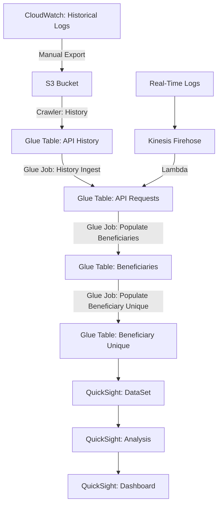

# BFD Insights: BFD Dashboards

## API-Requests

API-Requests is the portion of the project that ingests the logs and stores them in Glue tables. Normally, this happens in real time through AWS Kinesis Firehose, but it can also be done manually by exporting logs from CloudWatch and running a Glue Job to ingest them into the API-Requests table.

### Structure

### Manual Ingestion of Log Files

Note: You have to replace `<environment>` with the name of your environment, such as `prod` or `prod-sbx`.

1. CloudWatch > Log Groups > `/bfd/<environment>/bfd-server/access.json`
    - Actions > Export Data to Amazon S3
        - Choose time period
        - Select Account: *This Account*
        - S3 Bucket Name: `bfd-insights-bfd-app-logs`
        - S3 Bucket Prefix: `history/<environment>_api_history/`
    - Execute. This took about 80 minutes for 3 weeks of prod-sbx logs.

2. AWS Glue > Crawlers > `bfd-<environment>-history-crawler`
    - Run. It should finish within a couple minutes.

3. AWS Glue > Jobs > `bfd-<environment>-history-ingest`
    - Run. This took about 37 minutes for 3 weeks of prod-sbx logs.

4. AWS Glue > Jobs > `bfd-<environment>-populate-beneficiaries`
    - Run. This one took about 35 minutes for 3 weeks of prod-sbx logs.

5. AWS Glue > Crawlers > `bfd-<environment>-api-requests-recurring-crawler`
    - Run. It should finish within a couple minutes.

5. AWS Glue > Jobs > `bfd-<environment>-populate-beneficiary-unique`
    - Run.

## Beneficiaries

## Manual Creation of QuickSight Dashboards

Note: You have to replace `<environment>` with the name of your environment, such as `prod` or `prod-sbx`.

1. Go to [QuickSight](https://us-east-1.quicksight.aws.amazon.com/).
2. Datasets. New Dataset.
    - Athena.
        - Name your data source. Example: `bfd-<environment>-beneficiaries`
        - Athena Workgroup: `bfd`
        - Create Data Source.
    - Choose Your Table.
        - Catalog: `AwsDataCatalog`
        - Database: `bfd-<environment>`
        - Table: Choose the one you want to query. Ex: `bfd-<environment>-beneficiaries`
        - Select.
    - Finish dataset creation.
        - Directly query your data.
        - Visualize.
3. Create an analysis.
    - Under Visual Types (on the left), select `Line Chart`.
    - Expand Field Wells at the top.
    - Drag `# bene_id` from the left to "Value" under the Field Wells.
    - Drag `timestamp` (beneficiaries table) or `last_seen` (beneficiaries_unique table) to the "X Axis" under the Field Wells.
    - In the upper-right, click Share > Publish Dashboard. Choose a name. Example: `bfd-<environment>-beneficiaries`. The default options should be fine, so click Publish Dashboard.
