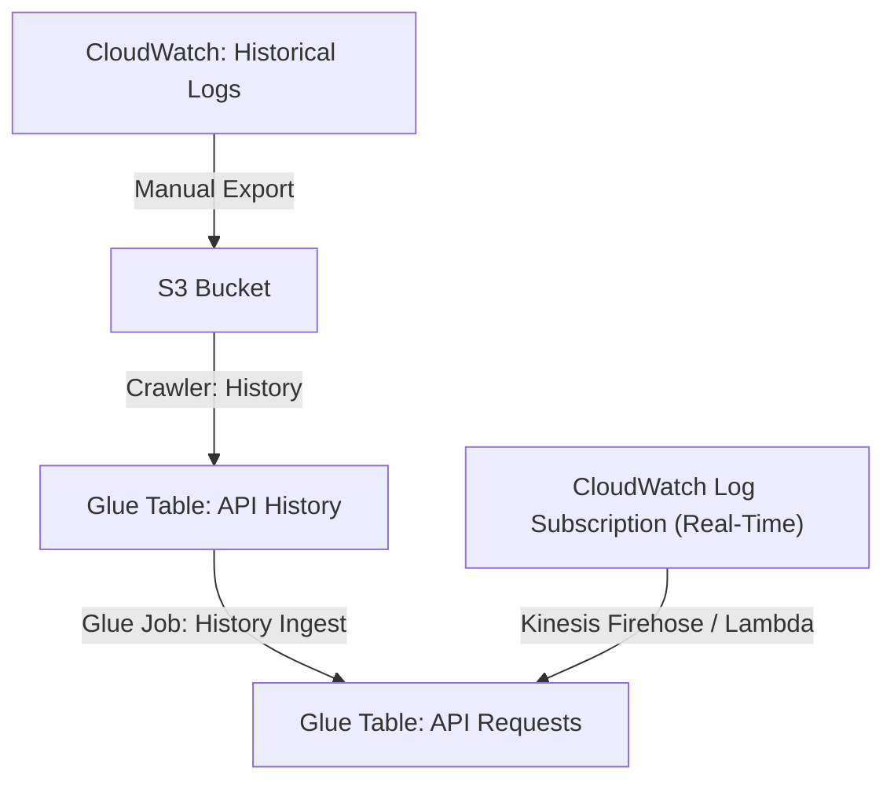

# BFD Insights: BFD Dashboards

BFD Insights captures data in near-real-time from the EC2 instances and provides the data for
analysis in QuickSight.


## API-Requests

API-Requests is the portion of the project that ingests the logs and stores them in Glue tables.
Normally, this happens in real time through AWS Kinesis Firehose, but it can also be done manually
by exporting logs from CloudWatch and running a Glue Job to ingest them into the API-Requests
table. Most other parts of this project will depend upon API-Requests.

## Naming Conventions

### AWS Resources

Somewhere in the BFD documentation (which I cannot presently find; please update if found), there
was a convention to name AWS resources to clearly identify that the resource belongs to BFD
Insights and to which project (BFD, BB2, AB2D, etc.), plus an identifier for the environment (prod,
prod-sbx, test). The convention is: `bfd-insights-<project>-<environment>-<identifier>` in kebab
case (lower-case words separated by hyphens). The exception is for AWS Glue / Athena table names,
which must be in snake case (lower-case separated by underscores), because the hyphen is not a
valid character in Athena table names. For example, we have
`bfd-insights-bfd-prod-sbx-firehose-ingester` and `bfd-insights-bfd-test-api-requests-crawler`.
However, for Glue Tables, we have `bfd_insights_bfd_prod_sbx_api_requests`.

### Terraform Resources

The terraform resource names do not need to be labeled with the
`bfd-insights-<project>-<environment>-` prefix, because it should be clear from context what project
they belong in, and environment is derived from the workspace. However, we have decided on a naming
convention like `<function>-<identifier>` in kebab case (lower-case words separated by hyphens), so
that even the modules, which do not clearly indicate the type of AWS resource they represent, will
be clear. For example, we have `module.glue-table-api-requests` and
`aws_glue_crawler.glue-crawler-api-requests`.

### Structure



### Adding new columns

The api_requests table has hard-coded column fields.

Based on historical log files, this list is meant to contain every field ever used *so far*. However, when new fields are added to the FHIR server's log files, they will also need to be added to api-requests/glue.tf and then the tables will need to be updated in AWS. The procedure is:

1. Add the new column to terraform.
2. Run terraform apply.
3. To verify that the new column has been added, wait about fifteen minutes to be sure that some log files have been processed via Kinesis Firehose, and then run a quick Athena query such as:

```sql
SELECT
  "cw_id",
  "cw_timestamp",
  "<new_field>"
FROM
  "bfd_insights_bfd_<underscore_environment>_api_requests"
WHERE
  "<new_field>" IS NOT NULL
LIMIT 50;
```

### Manual Ingestion of Log Files

Note: Replace `<environment>` and `<account-number>` with the name of your environment, such as
`prod` or `prod-sbx`, and the AWS account number, respectively. Replace any `-` with `_` in
`<underscore_environment>` (Athena doesn't like hyphens in table names).

1. CloudWatch > Log Groups > `/bfd/<environment>/bfd-server/access.json`
    - Actions > Export Data to Amazon S3
        - Choose time period
        - Select Account: *This Account*
        - S3 Bucket Name: `bfd-insights-bfd-app-logs`
        - S3 Bucket Prefix: `history/temp-<environment>`.
    - Export. This took about 80 minutes for 3 weeks of prod-sbx logs.

2. S3
    - Select bucket `bfd-insights-bfd-app-logs`
    - Go to path `history/temp-<environment>`
    - Select all objects *except* `aws-logs-write-test`
    - Actions > Move
        - Bucket
        - Destination: `bfd-insights-bfd-<account-number>/databases/bfd-insights-bfd-<environment>/bfd_insights_bfd_<underscore_environment>_api_history/`
        - Move

3. AWS Glue > Workflows > `bfd-insights-bfd-<environment>-history-workflow`
    - Actions > Run. The entire workflow may take a bit to run through, but you can track progress
    in the graph: History > (choose the top item) > Run Details.

## Beneficiaries

Beneficiaries is the portion that selects the beneficiary and timestamp from the API-Requests
table. Beneficiaries-Unique (which is included within this portion of BFD Insights) includes the
calculations of when each beneficiary was first queried.

### Structure


