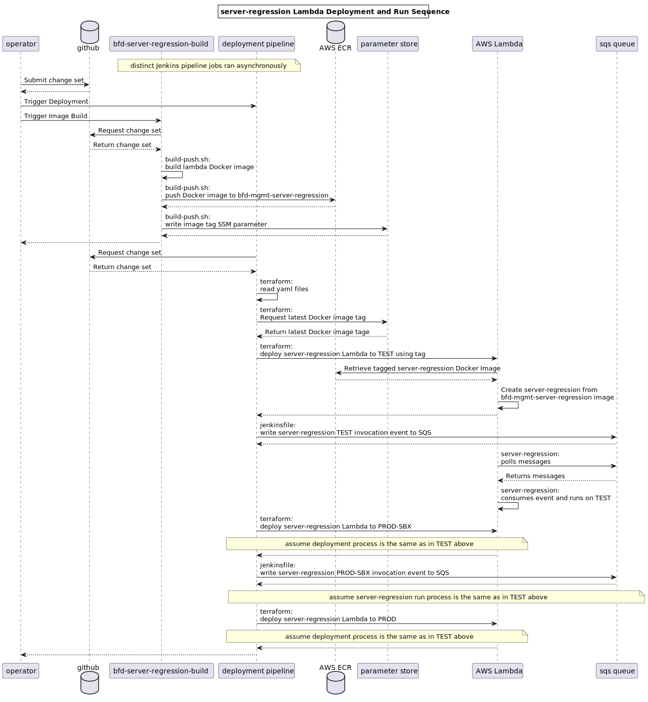

# BFD Server Regression Test Suite

## Infrastructure Diagram

The below diagram shows a high-level overview of the `server-regression` infrastructure. There are 
additional resources created by the terraform in this directory, but the major pieces of
infrastructure are included in this diagram.

<!-- BEGIN_TF_DOCS -->
<!-- GENERATED WITH `terraform-docs .`
     Manually updating the README.md will be overwritten.
     For more details, see the file '.terraform-docs.yml' or
     https://terraform-docs.io/user-guide/configuration/
-->
## Requirements

| Name | Version |
|------|---------|
|  [archive](#requirement\_archive) | 2.2.0 |
|  [aws](#requirement\_aws) | ~> 5.53.0 |

<!-- GENERATED WITH `terraform-docs .`
     Manually updating the README.md will be overwritten.
     For more details, see the file '.terraform-docs.yml' or
     https://terraform-docs.io/user-guide/configuration/
-->

## Inputs

| Name | Description | Type | Default | Required |
|------|-------------|------|---------|:--------:|
|  [docker\_image\_tag\_override](#input\_docker\_image\_tag\_override) | Overrides the Docker image URI used by the built regression suite lambda | `string` | `null` | no |

<!-- GENERATED WITH `terraform-docs .`
     Manually updating the README.md will be overwritten.
     For more details, see the file '.terraform-docs.yml' or
     https://terraform-docs.io/user-guide/configuration/
-->

## Resources

| Name | Type |
|------|------|
| [aws_cloudwatch_event_rule.spice_refresh_event_rule](https://registry.terraform.io/providers/hashicorp/aws/latest/docs/resources/cloudwatch_event_rule) | resource |
| [aws_cloudwatch_event_target.spice_refresh_event_target](https://registry.terraform.io/providers/hashicorp/aws/latest/docs/resources/cloudwatch_event_target) | resource |
| [aws_glue_crawler.this](https://registry.terraform.io/providers/hashicorp/aws/latest/docs/resources/glue_crawler) | resource |
| [aws_iam_policy.athena](https://registry.terraform.io/providers/hashicorp/aws/latest/docs/resources/iam_policy) | resource |
| [aws_iam_policy.glue](https://registry.terraform.io/providers/hashicorp/aws/latest/docs/resources/iam_policy) | resource |
| [aws_iam_policy.kms](https://registry.terraform.io/providers/hashicorp/aws/latest/docs/resources/iam_policy) | resource |
| [aws_iam_policy.logs](https://registry.terraform.io/providers/hashicorp/aws/latest/docs/resources/iam_policy) | resource |
| [aws_iam_policy.logs_glue_trigger](https://registry.terraform.io/providers/hashicorp/aws/latest/docs/resources/iam_policy) | resource |
| [aws_iam_policy.rds](https://registry.terraform.io/providers/hashicorp/aws/latest/docs/resources/iam_policy) | resource |
| [aws_iam_policy.s3](https://registry.terraform.io/providers/hashicorp/aws/latest/docs/resources/iam_policy) | resource |
| [aws_iam_policy.spice_refresh_logs_policy](https://registry.terraform.io/providers/hashicorp/aws/latest/docs/resources/iam_policy) | resource |
| [aws_iam_policy.spice_refresh_policy](https://registry.terraform.io/providers/hashicorp/aws/latest/docs/resources/iam_policy) | resource |
| [aws_iam_policy.sqs_send](https://registry.terraform.io/providers/hashicorp/aws/latest/docs/resources/iam_policy) | resource |
| [aws_iam_policy.ssm](https://registry.terraform.io/providers/hashicorp/aws/latest/docs/resources/iam_policy) | resource |
| [aws_iam_role.glue_trigger](https://registry.terraform.io/providers/hashicorp/aws/latest/docs/resources/iam_role) | resource |
| [aws_iam_role.spice_refresh_role](https://registry.terraform.io/providers/hashicorp/aws/latest/docs/resources/iam_role) | resource |
| [aws_iam_role.this](https://registry.terraform.io/providers/hashicorp/aws/latest/docs/resources/iam_role) | resource |
| [aws_iam_role_policy_attachment.spice_refresh_lambda_execution_policy_attach](https://registry.terraform.io/providers/hashicorp/aws/latest/docs/resources/iam_role_policy_attachment) | resource |
| [aws_iam_role_policy_attachment.spice_refresh_policy_attach](https://registry.terraform.io/providers/hashicorp/aws/latest/docs/resources/iam_role_policy_attachment) | resource |
| [aws_lambda_event_source_mapping.this](https://registry.terraform.io/providers/hashicorp/aws/latest/docs/resources/lambda_event_source_mapping) | resource |
| [aws_lambda_function.glue_trigger](https://registry.terraform.io/providers/hashicorp/aws/latest/docs/resources/lambda_function) | resource |
| [aws_lambda_function.spice_refresh_trigger](https://registry.terraform.io/providers/hashicorp/aws/latest/docs/resources/lambda_function) | resource |
| [aws_lambda_function.this](https://registry.terraform.io/providers/hashicorp/aws/latest/docs/resources/lambda_function) | resource |
| [aws_lambda_permission.allow_event_bridge_access](https://registry.terraform.io/providers/hashicorp/aws/latest/docs/resources/lambda_permission) | resource |
| [aws_lambda_permission.allow_s3_glue_trigger](https://registry.terraform.io/providers/hashicorp/aws/latest/docs/resources/lambda_permission) | resource |
| [aws_security_group.this](https://registry.terraform.io/providers/hashicorp/aws/latest/docs/resources/security_group) | resource |
| [aws_security_group_rule.rds](https://registry.terraform.io/providers/hashicorp/aws/latest/docs/resources/security_group_rule) | resource |
| [aws_sqs_queue.pipeline_signal](https://registry.terraform.io/providers/hashicorp/aws/latest/docs/resources/sqs_queue) | resource |
| [aws_sqs_queue.this](https://registry.terraform.io/providers/hashicorp/aws/latest/docs/resources/sqs_queue) | resource |
| [archive_file.glue_trigger](https://registry.terraform.io/providers/hashicorp/archive/2.2.0/docs/data-sources/file) | data source |
| [archive_file.spice_trigger](https://registry.terraform.io/providers/hashicorp/archive/2.2.0/docs/data-sources/file) | data source |
| [aws_caller_identity.current](https://registry.terraform.io/providers/hashicorp/aws/latest/docs/data-sources/caller_identity) | data source |
| [aws_ecr_authorization_token.token](https://registry.terraform.io/providers/hashicorp/aws/latest/docs/data-sources/ecr_authorization_token) | data source |
| [aws_ecr_image.image](https://registry.terraform.io/providers/hashicorp/aws/latest/docs/data-sources/ecr_image) | data source |
| [aws_ecr_repository.ecr](https://registry.terraform.io/providers/hashicorp/aws/latest/docs/data-sources/ecr_repository) | data source |
| [aws_iam_policy.permissions_boundary](https://registry.terraform.io/providers/hashicorp/aws/latest/docs/data-sources/iam_policy) | data source |
| [aws_iam_role.insights](https://registry.terraform.io/providers/hashicorp/aws/latest/docs/data-sources/iam_role) | data source |
| [aws_kms_key.cmk](https://registry.terraform.io/providers/hashicorp/aws/latest/docs/data-sources/kms_key) | data source |
| [aws_kms_key.config_cmk](https://registry.terraform.io/providers/hashicorp/aws/latest/docs/data-sources/kms_key) | data source |
| [aws_kms_key.insights_s3](https://registry.terraform.io/providers/hashicorp/aws/latest/docs/data-sources/kms_key) | data source |
| [aws_kms_key.mgmt_key](https://registry.terraform.io/providers/hashicorp/aws/latest/docs/data-sources/kms_key) | data source |
| [aws_region.current](https://registry.terraform.io/providers/hashicorp/aws/latest/docs/data-sources/region) | data source |
| [aws_s3_bucket.insights](https://registry.terraform.io/providers/hashicorp/aws/latest/docs/data-sources/s3_bucket) | data source |
| [aws_security_group.rds](https://registry.terraform.io/providers/hashicorp/aws/latest/docs/data-sources/security_group) | data source |
| [aws_ssm_parameter.docker_image_tag](https://registry.terraform.io/providers/hashicorp/aws/latest/docs/data-sources/ssm_parameter) | data source |
| [aws_ssm_parameters_by_path.nonsensitive_common](https://registry.terraform.io/providers/hashicorp/aws/latest/docs/data-sources/ssm_parameters_by_path) | data source |
| [aws_subnets.main](https://registry.terraform.io/providers/hashicorp/aws/latest/docs/data-sources/subnets) | data source |
| [aws_vpc.main](https://registry.terraform.io/providers/hashicorp/aws/latest/docs/data-sources/vpc) | data source |
<!-- END_TF_DOCS -->
