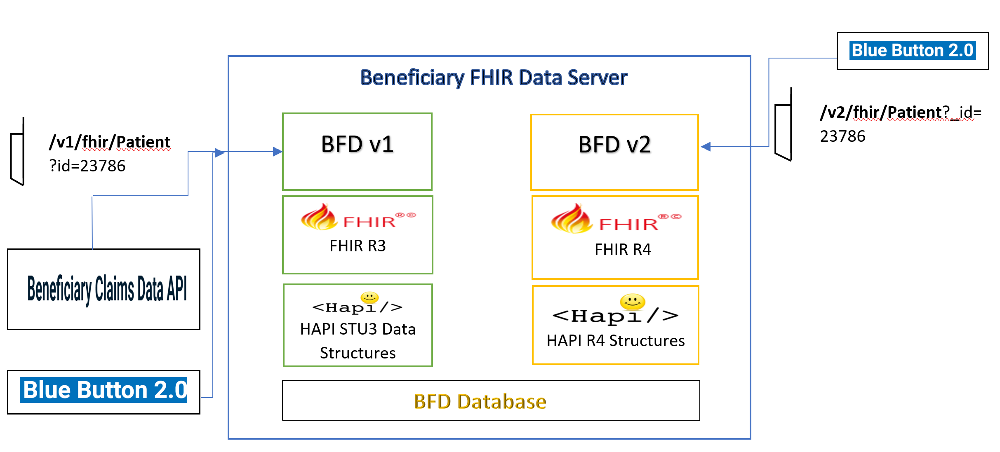

# RFC Proposal

[RFC Proposal]: #rfc-proposal

* RFC Proposal ID: `0000-bfd-v2-fhir-r4-carin`
* Start Date: TBD
* RFC PR: TBD
* JIRA Ticket(s):
* [BFD-285](https://jira.cms.gov/browse/BFD-285)

This RFC proposes that our team migrate from BFD v1 platform currently on FHIR STU3 to BFD v2 platform supporting the first normative FHIR release, R4 and implement CARIN BB profiles.

## Status
[Status]: #status

* Status: Implemented
* Implementation JIRA Ticket(s):
    * [BFD-907](https://jira.cms.gov/browse/BFD-907)

## Table of Contents
[Table of Contents]: #table-of-contents

* [RFC Proposal](#rfc-proposal)
* [Status](#status)
* [Table of Contents](#table-of-contents)
* [Motivation](#motivation)
* [Proposed Solution](#proposed-solution)
	* [Detailed Design](#detailed-design)
		* [HAPI Version](#hapi-version)
		* [HAPI Data Model](#hapi-data-model)
		* [Maven Dependency BFDv2](#maven-dependency-bfdv2)
		* [FHIR R4 Server](#fhir-r4-server)
		* [Spring Configuration](#spring-configuration)
		* [BFDv2 Resource Providers](#bfdv2-resource-providers)
	* [Current State](#current-state)
	* [Future State](#future-state)
	* [Differential View](#differential-view)
	* [Unresolved Questions](#unresolved-questions)
	* [Drawbacks](#proposed-solution-drawbacks)
	* [Notable Alternatives](#proposed-solution-notable-alternatives)
* [Prior Art](#prior-art)
* [Future Possibilities](#future-possibilities)
* [Addendums](#addendums)

## Motivation
[Motivation]: #motivation

BFDv2 will make BFD's FHIR resources increase the system's conformance with FHIR R4 and industry alliance like CARIN.
This will help BFD move its platform to use the first normative release of FHIR (R4). This will also make integration and 
interoperability with all our peer partners seamless by enabling to provide FHIR-R4 validated and conformant resources
for Patient, Coverage and Explanation Of Benefits (EOB's).

## Proposed Solution
[Proposed Solution]: #proposed-solution

BFD proposes to provide a new v2 endpoint URL (future state) and will make no structural or architectural change to the v1 endpoint (current state). The goal is for partners to not have to make any changes in their existing integration points with BFD.

**BFD v2 WILL NOT be backward compatible with BFD v1 and Peer Parrtners will not be able to use their existing v1 connectors/interfaces/integration points for v2 consumption.**

**BFD v2 to take a middle approach and make best efforts to minimize redundancy:**

* Identify Common components and cross cutting concerns which are independent of HAPI data models and which can be safely abstracted for both v1 and v2.
* Have version specific Utiliy components which are tied to HAPI data models (stu3 and r4).
* Have FHIR/HAPI version specific Resource providers and Transformers.
* V1 is not largely" going to change. No new fields. Only production bug fixes and SLO adherence.
* v2 will be a work in progress based on business and industry standard needs.
* Explore and implement shared "resource provider" components between v1 and v2.

BFD v2 endpoint will support the following FHIR resources:  

* Patient (BFD v2, FHIR r4)
* Coverage (BFD v2, FHIR r4)
* ExplanationOfBenefit (BFD v2, FHIR r4)

An idicative v2 endpoint is below:  

https://localhost:1337/v2/fhir/Patient?_id=-19990000000001&_format=json

Link to FHIR R4 and CARIN BB Profiles is below:  

FHIR R4 (US-Core, Normative release):
http://hl7.org/fhir/R4

CARIN BB Profiles:
http://build.fhir.org/ig/HL7/carin-bb

### Detailed Design

[Detailed Design]: #detailed-design

#### HAPI Version 
[HAPI Version]: #hapi-version

	HAPI FHIR 4.x

#### HAPI Data Model 
[HAPI Data Model]: #hapi-data-model 

		* org.hl7.fhir.r4.model.Patient
		* org.hl7.fhir.r4.model.Coverage
		* org.hl7.fhir.r4.model.ExplanationOfBenefit

#### Maven Dependency BFDv2
[Maven Dependency BFDv2]: #maven-dependency-bfdv2

		<dependency>
			<!-- At least one "structures" JAR must also be included -->
			<groupId>ca.uhn.hapi.fhir</groupId>
			<artifactId>hapi-fhir-structures-r4</artifactId>
			<version>${hapi-fhir.version}</version>
		</dependency>

#### FHIR R4 Server
[FHIR R4 Server]: #fhir-r4-server		

**Constructs a new R4Server instance:**
	
	public R4Server() {
		super(FhirContext.forR4());
		setServerAddressStrategy(ApacheProxyAddressStrategy.forHttp());
		configureServerInfoMetadata();
	}

	Register the new HAPI R4 server with the Servlet Context to support v2 endpoints and add the mapping for v2 traffic:

    R4Server r4Servlet = new R4Server();
    cxfServletReg = servletContext.addServlet("r4Servlet", r4Servlet);
    cxfServletReg.setLoadOnStartup(1);
    cxfServletReg.addMapping("/v2/fhir/*");

#### Spring Configuration:
[Spring Configuration]: #spring-configuration	

**Defines a new Spring Bean in the Spring Configuration for the Spring IoC container to support v2 traffic to BFD.**

 /**
   * @param r4PatientResourceProvider the application's {@link R4PatientResourceProvider} bean
   * @param r4CoverageResourceProvider the application's {@link R4CoverageResourceProvider} bean
   * @param r4EobResourceProvider the application's {@link R4ExplanationOfBenefitResourceProvider}
   *     bean
   * @return the {@link List} of R4 {@link IResourceProvider} beans for the application
   */
  @Bean(name = BLUEBUTTON_R4_RESOURCE_PROVIDERS)
  public List<IResourceProvider> r4ResourceProviders(
      R4PatientResourceProvider r4PatientResourceProvider,
      R4CoverageResourceProvider r4CoverageResourceProvider,
      R4ExplanationOfBenefitResourceProvider r4EobResourceProvider) {
    List<IResourceProvider> r4ResourceProviders = new ArrayList<IResourceProvider>();
    r4ResourceProviders.add(r4PatientResourceProvider);
    r4ResourceProviders.add(r4CoverageResourceProvider);
    r4ResourceProviders.add(r4EobResourceProvider);
    return r4ResourceProviders;
  }
  
**Each IResourceProvider adds support for a specific FHIR resource.**
  
    List<IResourceProvider> resourceProviders =
        springContext.getBean(SpringConfiguration.BLUEBUTTON_R4_RESOURCE_PROVIDERS, List.class);
    setResourceProviders(resourceProviders);

#### BFDv2 Resource Providers:
[BFDv2 Resource Providers]: #bfdv2-resource-providers

**BFDv2 will have it own resource providers and supporting transformers to support FHIR R4 and CARIN conformance needs. It will use HAPI R4 Data Structures as mentioned above.**

		gov.cms.bfd.server.war.r4.providers.R4PatientResourceProvider
		gov.cms.bfd.server.war.r4.providers.R4CoverageResourceProvider
		gov.cms.bfd.server.war.r4.providers.R4ExplanationOfBenefitResourceProvider
		

#### CARIN IG

http://build.fhir.org/ig/HL7/carin-bb/

Summary:  
Mandatory: 2 elements  
Must-Support: 1 element  
Slices:  
This structure defines the following Slices:  
The element Patient.identifier is sliced based on the values of value:type, value:system

### Current State
[Current State]: #current-state

Please see Patient v2 RFC for an indicative and sample CURRENT state resource.

### Future State
[Future State]: #future-state

Please see Patient v2 RFC for an indicative and sample FUTURE state resource .

### Differential View
Please see Patient v2 RFC for an indicative and sample differential Payload view between v1 and v2 resource.

### Unresolved Questions
[Unresolved Questions]: #unresolved-questions

The following question needs to be resolved:

	How long will v1 and v2 be supported in parallel?
	
	**RESOLVED:** Dec 31, 2021
 		

### Proposed Solution: Drawbacks
[Proposed Solution: Drawbacks]: #proposed-solution-drawbacks

1. Supporting both v1 and v2 in parallel may cause slight performance issues.
 

### Proposed Solution: Notable Alternatives
[Proposed Solution: Notable Alternatives]: #proposed-solution-notable-alternatives

NA.

## Prior Art
[Prior Art]: #prior-art

BFD project already has a reasonable amount of experience with FHIR DSTU3/R3 and CARIN engagement, those experiences have been very positive.

## Future Possibilities
[Future Possibilities]: #future-possibilities

No future possibilities are being seriously considered at this time.

## Addendums
[Addendums]: #addendums

The following addendums are required reading before voting on this proposal: None