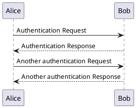

# Resources
This directory is intended to provide a home for non-text resources that are referenced by text within the RFC documents, e.g. graphical diagrams, images, etc. It's inspired by a directory of the same name featured in the [rust-lang/rfcs repository](https://github.com/rust-lang/rfcs). At the time of this writing, the resources directory includes just one image in an SVG format. 

## PlantUML
[PlantUML](https://github.com/plantuml/plantuml) is "is an open-source tool allowing users to create diagrams from a plain text language" (from the [PlantUML entry on Wikipedia](https://en.wikipedia.org/wiki/PlantUML)). It's capable of producing commong diagrams, both UML and otherwise, in a variety of formats including ASCII diagrams, PNG, SVG.

### PlantUML SVGs
It's _probably_ not unique to PlantUML, but no less helpful, the SVG output features an embdedd comment that includes both the MD5 hash of the diagram as well as DSL source code. For this reason, the original PlantUML DSL encoded files can be considered optional.

#### PlantUML Example

The following example in plantuml with a comment describing the export to SVG, note that only comments inside the `@startuml` and `@enduml` will appear in the resultant SVG/XML:


Rendering as an SVG using the prescribed comment embedded in the diagram's DSL above:

``` sh
export PLANTUML_JAR=<path-to-your-plantuml-jar>
java -jar $PLANTUML_JAR -svg hello-world.plantuml
```

Rendered as an SVG in the raw XML format, note the final comment:

```xml
<?xml version="1.0" encoding="UTF-8" standalone="no"?><svg xmlns="http://www.w3.org/2000/svg" xmlns:xlink="http://www.w3.org/1999/xlink" contentScriptType="application/ecmascript" contentStyleType="text/css" height="221px" preserveAspectRatio="none" style="width:295px;height:221px;background:#FFFFFF;" version="1.1" viewBox="0 0 295 221" width="295px" zoomAndPan="magnify"><defs><filter height="300%" id="fuqcworyn19rk" width="300%" x="-1" y="-1"><feGaussianBlur result="blurOut" stdDeviation="2.0"/><feColorMatrix in="blurOut" result="blurOut2" type="matrix" values="0 0 0 0 0 0 0 0 0 0 0 0 0 0 0 0 0 0 .4 0"/><feOffset dx="4.0" dy="4.0" in="blurOut2" result="blurOut3"/><feBlend in="SourceGraphic" in2="blurOut3" mode="normal"/></filter></defs><g><line style="stroke:#A80036;stroke-width:1.0;stroke-dasharray:5.0,5.0;" x1="30" x2="30" y1="40.4883" y2="177.7305"/><line style="stroke:#A80036;stroke-width:1.0;stroke-dasharray:5.0,5.0;" x1="263.5" x2="263.5" y1="40.4883" y2="177.7305"/><rect fill="#FEFECE" filter="url(#fuqcworyn19rk)" height="30.4883" style="stroke:#A80036;stroke-width:1.5;" width="47" x="5" y="5"/><text fill="#000000" font-family="sans-serif" font-size="14" lengthAdjust="spacing" textLength="33" x="12" y="25.5352">Alice</text><rect fill="#FEFECE" filter="url(#fuqcworyn19rk)" height="30.4883" style="stroke:#A80036;stroke-width:1.5;" width="47" x="5" y="176.7305"/><text fill="#000000" font-family="sans-serif" font-size="14" lengthAdjust="spacing" textLength="33" x="12" y="197.2656">Alice</text><rect fill="#FEFECE" filter="url(#fuqcworyn19rk)" height="30.4883" style="stroke:#A80036;stroke-width:1.5;" width="40" x="241.5" y="5"/><text fill="#000000" font-family="sans-serif" font-size="14" lengthAdjust="spacing" textLength="26" x="248.5" y="25.5352">Bob</text><rect fill="#FEFECE" filter="url(#fuqcworyn19rk)" height="30.4883" style="stroke:#A80036;stroke-width:1.5;" width="40" x="241.5" y="176.7305"/><text fill="#000000" font-family="sans-serif" font-size="14" lengthAdjust="spacing" textLength="26" x="248.5" y="197.2656">Bob</text><polygon fill="#A80036" points="251.5,67.7988,261.5,71.7988,251.5,75.7988,255.5,71.7988" style="stroke:#A80036;stroke-width:1.0;"/><line style="stroke:#A80036;stroke-width:1.0;" x1="30.5" x2="257.5" y1="71.7988" y2="71.7988"/><text fill="#000000" font-family="sans-serif" font-size="13" lengthAdjust="spacing" textLength="147" x="37.5" y="67.0566">Authentication Request</text><polygon fill="#A80036" points="41.5,97.1094,31.5,101.1094,41.5,105.1094,37.5,101.1094" style="stroke:#A80036;stroke-width:1.0;"/><line style="stroke:#A80036;stroke-width:1.0;stroke-dasharray:2.0,2.0;" x1="35.5" x2="262.5" y1="101.1094" y2="101.1094"/><text fill="#000000" font-family="sans-serif" font-size="13" lengthAdjust="spacing" textLength="157" x="47.5" y="96.3672">Authentication Response</text><polygon fill="#A80036" points="251.5,126.4199,261.5,130.4199,251.5,134.4199,255.5,130.4199" style="stroke:#A80036;stroke-width:1.0;"/><line style="stroke:#A80036;stroke-width:1.0;" x1="30.5" x2="257.5" y1="130.4199" y2="130.4199"/><text fill="#000000" font-family="sans-serif" font-size="13" lengthAdjust="spacing" textLength="199" x="37.5" y="125.6777">Another authentication Request</text><polygon fill="#A80036" points="41.5,155.7305,31.5,159.7305,41.5,163.7305,37.5,159.7305" style="stroke:#A80036;stroke-width:1.0;"/><line style="stroke:#A80036;stroke-width:1.0;stroke-dasharray:2.0,2.0;" x1="35.5" x2="262.5" y1="159.7305" y2="159.7305"/><text fill="#000000" font-family="sans-serif" font-size="13" lengthAdjust="spacing" textLength="209" x="47.5" y="154.9883">Another authentication Response</text><!--MD5=[7b907e995d48c862f5d0492a126b987a]
@startuml
/'
 ' export PLANTUML_JAR=<path-to-your-plantuml-jar>
 ' java -jar $PLANTUML_JAR -svg hello-world.plantuml
 '/
Alice -> Bob: Authentication Request
Bob - -> Alice: Authentication Response
Alice -> Bob: Another authentication Request
Alice <- - Bob: Another authentication Response
@enduml

@startuml
Alice -> Bob: Authentication Request
Bob - -> Alice: Authentication Response
Alice -> Bob: Another authentication Request
Alice <- - Bob: Another authentication Response
@enduml

PlantUML version 1.2022.1(Tue Feb 01 12:19:58 CST 2022)
(GPL source distribution)
Java Runtime: OpenJDK Runtime Environment
JVM: OpenJDK 64-Bit Server VM
Default Encoding: UTF-8
Language: en
Country: US
--></g></svg>
```
