# Recreating `server-regression` QuickSight Dashboards

Follow this runbook in the event that the QuickSight dashboards for the `server-regression`'s test suite's performance metrics are ever destroyed and need to be recreated.

As of writing, the following dashboards are available to view for members of the BFD team:

- [`bfd-test-server-regression`](https://us-east-1.quicksight.aws.amazon.com/sn/dashboards/598e729a-90c6-418a-a59e-e4b18d9f6dff)
- [`bfd-prod-sbx-server-regression`](https://us-east-1.quicksight.aws.amazon.com/sn/dashboards/09e53c86-acbb-437a-b451-63123fdceab4)
- [`bfd-prod-server-regression`](https://us-east-1.quicksight.aws.amazon.com/sn/dashboards/7c9c77bb-34fe-4434-a9f6-41d700d058a7)

> **Note:** The above dashboards can also be found in QuickSight's ["Dashboards" view](https://us-east-1.quicksight.aws.amazon.com/sn/start/dashboards)

## Glossary

|        Term         |                                                                   Definition                                                                   |
| :-----------------: | :--------------------------------------------------------------------------------------------------------------------------------------------: |
| `server-regression` | Technical identifier for the Locust-based performance regression test suite that runs against BFD Server during deployment in all environments |
|     QuickSight      |              An AWS Service that allows for the creation of visual dashboards from various datasets (i.e. S3, RDS, Athena, etc.)               |
|       Dataset       |                  QuickSight's term for a data store (such as S3, Athena, etc) along with the fields to display from the store                  |
|      Analysis       |                                       A work-in-progress Dashboard that uses a Dataset to display fields                                       |
|      Dashboard      |                                          A collection of graphs and visuals that represents a Dataset                                          |
|       Athena        |                                An AWS Service that is used to analyze data stored in AWS S3 using standard SQL                                 |

## FAQ

<!-- This section should contain frequently-asked-questions as sub-headers with answers as sub-paragraphs. Since this is a living document, this section should be added to as needed. -->

### Will the `hash` in each of the Dataset SQL queries below ever change? What is it used for?

Firstly, the `hash` (or, more specifically, `metadata.hash`) is a SHA256 hash of various test parameters and metadata values
from a given test suite run. Performance metrics with the same `metadata.hash` value can be confidently compared as they
were collected from test suite runs that were started with the same parameters (i.e. number of simulated users, desired
test runtime, types of tests run, etc.).

There are really only two scenarios where the hash could change:

1. The parameters (runtime, user count, spawn rate) that control how the `server-regression` test suite runs during BFD Server deployments change from their current defaults
2. The code to generate the hash changes because we add an additional field or want to change the hashing algorithm

These scenarios are unlikely for the following reasons:

1. With the current parameters, consistent and _useful_ results are being captured with minimal increase in deployment time. That is to say, at time of writing there is no benefit in changing these parameters
2. There is no additional metadata that Locust exposes that we would want to include in the hash to further delineate performance metrics that _can_ or _can't_ be compared

If, however, the hash _does_ change in the future, the queries listed below will need to be updated **in both** this runbook and in each of
the Datasets in QuickSight. Note that this scenario will be easy to identify, as the visuals in each Dashboard will stop displaying
data.

## Instructions

1. You will need to navigate to the QuickSight AWS Service in order to start creating QuickSight Dashboards

   1. Navigate to `aws.amazon.com` in any browser
   2. Click the "Sign In" link in the navigation bar on the top right of the screen
   3. Enter your AWS account credentials and sign-in
   4. You should now have navigated to the "Console Home", click the search input in the navigation bar on the top left of the screen
   5. Type "QuickSight" and click the QuickSight result that appears

2. Every QuickSight dashboard requires a _Dataset_, which for the `server-regression` dashboards will be a `Custom SQL` query against Athena. As there will be three dashboards, there will be three datasets (one dataset for each dashboard)

   1. Creating the `bfd-test-server-regression` dataset:

      1. Navigate to "Datasets" in QuickSight (click on "Datasets" in the navigation tree on the left side of the page)
      2. Click the "New dataset" button on the top-left of the page
      3. The page that appears should list a large number of possible data sources. Find "Athena" in this list, and click on it
      4. Enter "bfd-test-server-regression" for the "Data source name"
      5. Choose `bfd` for the "Athena workgroup"
      6. Click "Create data source"
      7. Choose `AwsDataCatalog` as the "Catalog"
      8. Choose `bfd-insights-bfd-test` as the "Database"
      9. Choose `bfd_insights_bfd_test_server_regression` as the "Table"
      10. Click "Use custom SQL"
      11. In the first input box, enter "bfd-test-server-regression" (replacing "New custom SQL")
      12. In the large text area, enter the following SQL query:

      ```sql
      select
        totals.total_reqs_per_second,
        totals.num_requests as total_requests,
        totals.num_failures as total_failures,
        totals.min_response_time as total_min_response_time,
        totals.average_response_time as total_avg_response_time,
        totals.median_response_time as total_median_response_time,
        totals.response_time_percentiles."0.95" as total_95_percentile,
        totals.response_time_percentiles."0.99" as total_99_percentile,
        totals.response_time_percentiles."1.0" as total_100_percentile,
        metadata.compare_result,
        date_format(from_unixtime(metadata.timestamp, 'US/Eastern'), '%b-%e-%y %T EST') as date_time,
        metadata.timestamp as raw_timestamp
      from "bfd-insights-bfd-test"."bfd_insights_bfd_test_server_regression"
      where
        metadata.hash = '85d93b342368c8f57f8e78ea6c56979ad5e32901776aaeaffdd8467e4cee1df9'
        and contains(metadata.tags, 'master')
        and (
           metadata.validation_result = 'PASSED'
           or metadata.validation_result = 'NOT_APPLICABLE'
        )
      order by metadata.timestamp asc
      ```

      13. Click "Confirm query"
      14. In "Finish dataset creation", select "Directly query your data"
      15. Click "Edit/preview data"
      16. An editor should appear with the SQL you entered above, click "Apply"
      17. Ensure that data is returned in the data preview
      18. Click "SAVE & PUBLISH" in the navigation bar on the top right of the screen
      19. Ensure that an in-page notification appears indicating the dataset was saved successfully
      20. Click "CANCEL" in the navigation bar on the top right of the screen to exit the Dataset creation page and return to QuickSight Home

   2. Creating the `bfd-prod-sbx-server-regression` dataset:

      1. Navigate to "Datasets" in QuickSight (click on "Datasets" in the navigation tree on the left side of the page)
      2. Click the "New dataset" button on the top-left of the page
      3. The page that appears should list a large number of possible data sources. Find "Athena" in this list, and click on it
      4. Enter "bfd-prod-sbx-server-regression" for the "Data source name"
      5. Choose `bfd` for the "Athena workgroup"
      6. Click "Create data source"
      7. Choose `AwsDataCatalog` as the "Catalog"
      8. Choose `bfd-insights-bfd-prod-sbx` as the "Database"
      9. Choose `bfd_insights_bfd_prod_sbx_server_regression` as the "Table"
      10. Click "Use custom SQL"
      11. In the first input box, enter "bfd-prod-sbx-server-regression" (replacing "New custom SQL")
      12. In the large text area, enter the following SQL query:

      ```sql
      select
        totals.total_reqs_per_second,
        totals.num_requests as total_requests,
        totals.num_failures as total_failures,
        totals.min_response_time as total_min_response_time,
        totals.average_response_time as total_avg_response_time,
        totals.median_response_time as total_median_response_time,
        totals.response_time_percentiles."0.95" as total_95_percentile,
        totals.response_time_percentiles."0.99" as total_99_percentile,
        totals.response_time_percentiles."1.0" as total_100_percentile,
        metadata.compare_result,
        date_format(from_unixtime(metadata.timestamp, 'US/Eastern'), '%b-%e-%y %T EST') as date_time,
        metadata.timestamp as raw_timestamp
      from "bfd-insights-bfd-prod-sbx"."bfd_insights_bfd_prod_sbx_server_regression"
      where
        metadata.hash = '71a5310d52e0ffb8c03dc74cdee7bf635bc7fbd75dfe1d8f647fcfb11e5b65ce'
        and contains(metadata.tags, 'master')
        and (
           metadata.validation_result = 'PASSED'
           or metadata.validation_result = 'NOT_APPLICABLE'
        )
      order by metadata.timestamp asc
      ```

      13. Click "Confirm query"
      14. In "Finish dataset creation", select "Directly query your data"
      15. Click "Edit/preview data"
      16. An editor should appear with the SQL you entered above, click "Apply"
      17. Ensure that data is returned in the data preview
      18. Click "SAVE & PUBLISH" in the navigation bar on the top right of the screen
      19. Ensure that an in-page notification appears indicating the dataset was saved successfully
      20. Click "CANCEL" in the navigation bar on the top right of the screen to exit the Dataset creation page and return to QuickSight Home

   3. Creating the `bfd-prod-server-regression` dataset:

      1. Navigate to "Datasets" in QuickSight (click on "Datasets" in the navigation tree on the left side of the page)
      2. Click the "New dataset" button on the top-left of the page
      3. The page that appears should list a large number of possible data sources. Find "Athena" in this list, and click on it
      4. Enter "bfd-prod-server-regression" for the "Data source name"
      5. Choose `bfd` for the "Athena workgroup"
      6. Click "Create data source"
      7. Choose `AwsDataCatalog` as the "Catalog"
      8. Choose `bfd-insights-bfd-prod` as the "Database"
      9. Choose `bfd_insights_bfd_prod_server_regression` as the "Table"
      10. Click "Use custom SQL"
      11. In the first input box, enter "bfd-prod-server-regression" (replacing "New custom SQL")
      12. In the large text area, enter the following SQL query:

      ```sql
      select
        totals.total_reqs_per_second,
        totals.num_requests as total_requests,
        totals.num_failures as total_failures,
        totals.min_response_time as total_min_response_time,
        totals.average_response_time as total_avg_response_time,
        totals.median_response_time as total_median_response_time,
        totals.response_time_percentiles."0.95" as total_95_percentile,
        totals.response_time_percentiles."0.99" as total_99_percentile,
        totals.response_time_percentiles."1.0" as total_100_percentile,
        metadata.compare_result,
        date_format(from_unixtime(metadata.timestamp, 'US/Eastern'), '%b-%e-%y %T EST') as date_time,
        metadata.timestamp as raw_timestamp
      from "bfd-insights-bfd-prod"."bfd_insights_bfd_prod_server_regression"
      where
        metadata.hash = '727a44e865e717728ac409e8e23a7e13ce73a155874f3832a0caef1fde17e95c'
        and contains(metadata.tags, 'master')
        and (
           metadata.validation_result = 'PASSED'
           or metadata.validation_result = 'NOT_APPLICABLE'
        )
      order by metadata.timestamp asc
      ```

      13. Click "Confirm query"
      14. In "Finish dataset creation", select "Directly query your data"
      15. Click "Edit/preview data"
      16. An editor should appear with the SQL you entered above, click "Apply"
      17. Ensure that data is returned in the data preview
      18. Click "SAVE & PUBLISH" in the navigation bar on the top right of the screen
      19. Ensure that an in-page notification appears indicating the dataset was saved successfully
      20. Click "CANCEL" in the navigation bar on the top right of the screen to exit the Dataset creation page and return to QuickSight Home

3. Navigate to "Analyses" in QuickSight (click on "Analyses" in the navigation tree on the left side of the page from the QuickSight "home")
4. Click "New analysis" on the top right of the page
5. Choose `bfd-test-server-regression`
6. A new page should appear with details about the dataset. Click on "USE IN ANALYSIS"
7. A new page should appear with an empty "AutoGraph" and a variety of controls on the left-side:
   1. 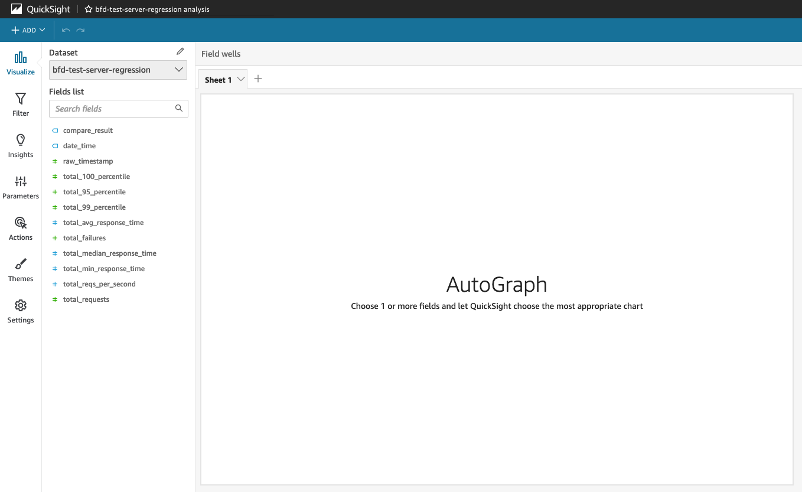
8. Start by re-creating all of the line graphs for the `server-regression` dashboard:

   1. Click anywhere within the empty "AutoGraph". An outline should appear indicating it has been selected, along with controls in the top-right corner
   2. In "Visual types", choose a line graph (red outlined button in figure):
      1. 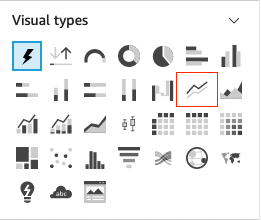
   3. The graph's title/description should change to "You need to add or remove fields" and the collapsed "Field wells" section should expand showing "X axis", "Value", and "Color" as shown in the following figure:
      1. 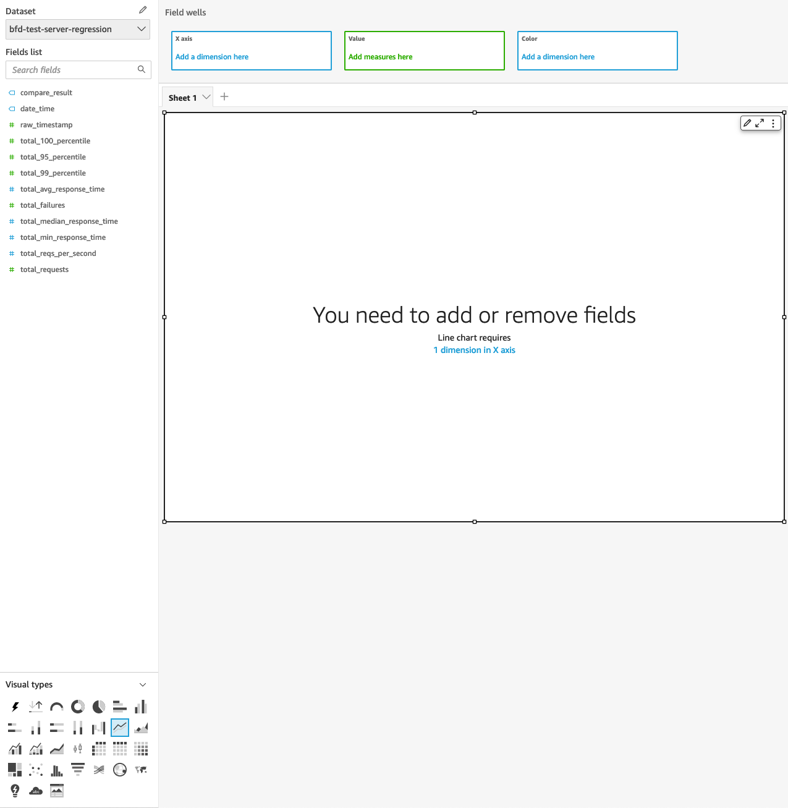
   4. In the "Fields list", click and drag "date_time" to the "X axis" control in "Field wells". You should see the graph update after doing so
   5. In the "Fields list", click and drag "total_reqs_per_second" to the "Value" control in "Field wells". You should see the graph update, and the page should look like the following:
      1. 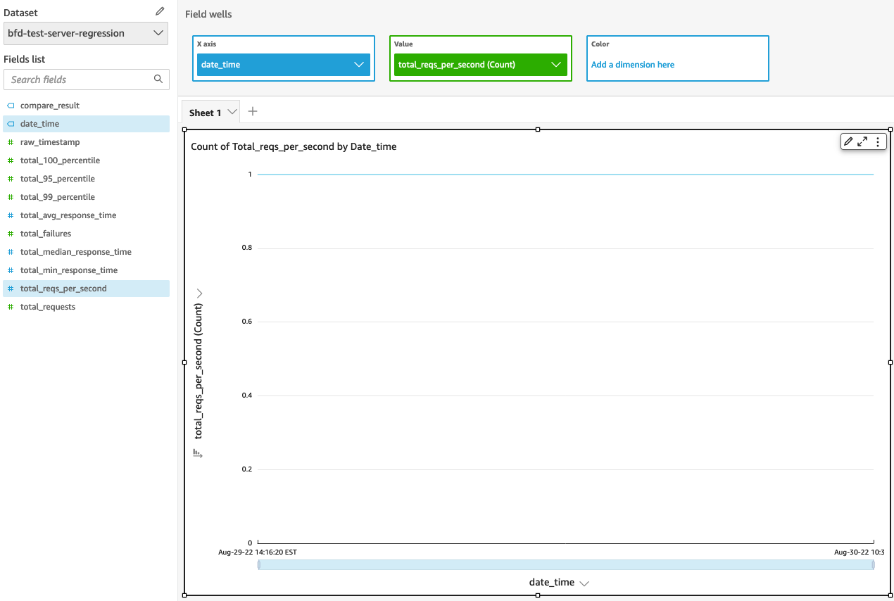
   6. <a id="change-aggregation"></a>The graph's "Value" is currently representing the unique count of the "total_reqs_per_second" which is not correct. Click on "total_reqs_per_second (Count)" in the "Value" control in the "Field wells" section. A dropdown menu should appear
   7. Click on "Aggregate: Count". An additional dropdown menu should appear to the right of the menu
   8. Click on "Sum" in the list of aggregations
   9. The graph should update and the values being graphed should be correct, as shown below (note the values will be different, but the graph should now be graphing the actual _value_ of `total_reqs_per_second`):
      1. 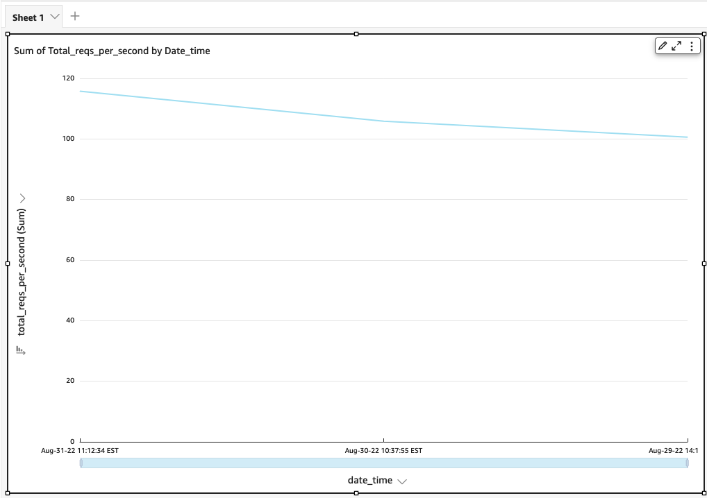
   10. <a id="sort-raw-timestamp"></a>The graph's x-axis (`date_time`) is currently sorted alphabetically and not by time. Similar to above, click on "date_time" in the "X axis" control in "Field wells". A dropdown menu should appear. The first item in the menu should be "Sort by" and should be "total_reqs_per_second" as shown in the figure:
       1. 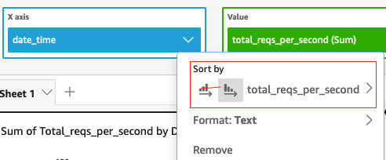
   11. Click on the "Sort by" option (highlighted by the red outline in the figure above). A second dropdown should appear to the right of the original menu
   12. Click on "Sort options" in the second, right-most dropdown
   13. The left pane (where "Fields list" was) should be replaced by "Sort options". In the select/dropdown menu labeled "Sort by", select "raw_timestamp" as shown in the figure below:
       1. 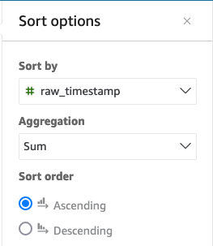
   14. Click "Apply" at the bottom of the "Sort options" pane. The graph should update and now be ordered correctly by time
   15. Click "Close". The left-most pane should switch back to "Fields list"
   16. <a id="change-graph-title"></a>Change the title of the graph to "Total RPS Over Time" by double-clicking on the current title ("Sum of Total_reqs_per_second by Date_time") and entering the new title in the text area
   17. <a id="change-axis-label"></a>Double-click the y-axis label ("total_reqs_per_second (Sum)", shown vertically). A dropdown menu should appear
   18. Select "Rename" from the dropdown menu
   19. Rename to "Total Requests-Per-Second"
   20. Follow the same steps as above to rename the x-axis, but this time the name should be "Date and Time (EST)"
   21. <a id="enable-data-labels"></a>Hover over the graph and click the small pencil icon in the top right corner. Hovering over the icon should show a tooltip with the text "Format visual". The "Fields list" pane should be replaced by a pane named "Format visual" on the leftside of the page, as shown below:
       1. 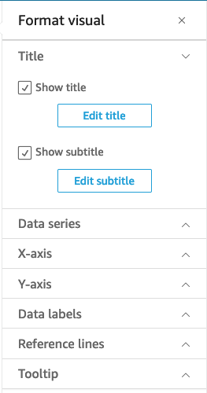
   22. There should be multiple collapsible sections, click on "Data labels"
   23. Click on the "Show data labels" checkbox. Each point on the line graph should now be labeled with its value
   24. <a id="duplicate-graph"></a>Hover over the graph again and this time click the three-dots in the top right corner. A dropdown menu should appear
   25. Click "Duplicate visual"
   26. A duplicate of the original "Total RPS Over Time" line graph should appear to the right
   27. Click on this new, duplicate graph. It should become outlined
   28. Uncollapse the "Field wells" section above the graphs by clicking anywhere within it
   29. Click on the green "total_reqs_per_second (Sum)" button in the "Value" section. A dropdown menu should appear
   30. In the very bottom of the dropdown menu, beneath the "Search fields" input, find "total_requests". Click on it
   31. The graph's y-axis should change to "total_requests (Sum)" and the "Value" of the graph should now be "total_requests (Sum)"
   32. Change the title of the graph to "Total Requests over Time" [following instructions above](#change-graph-title)
   33. Change the title of the y-axis to "Total Requests" [following instructions above](#change-axis-label)
   34. Ensure the title of the x-axis remains "Date and Time (EST)". If not, change it [following instructions above](#change-axis-label)
   35. Ensure that data labels appear above each point in the graph. If not, change it [following instructions above](#enable-data-labels)
   36. Duplicate any of the two graphs [following the instructions above](#duplicate-graph). A third graph should appear on bottom-left of the screen
   37. Following instructions outlined above, change the "Value"/y-axis of the graph to "total_failures"
   38. Change the title to "Number of Total Request Failures over Time"
   39. Change the y-axis title to "Total Failures"
   40. Ensure the x-axis title is "Date and Time (EST)"
   41. Ensure data labels appear above each point in the line graph
   42. Navigate to "Format visual" (ensure that the new failures graph is selected)
   43. In the "Title" collapsible section, click the "Edit subtitle" button
   44. Change the subtitle to "Successful runs should always have 0 failures"

9. Next, recreate the totals bar charts

   1. <a id="create-new-visual"></a>On the top-left of the page, click the "ADD" button. A dropdown menu should appear
   2. Select "Add visual". A new "AutoGraph" should appear on the page
   3. From "Visual types" (bottom collapsible section of the left-pane) select "Vertical bar chart" (top-most row, right-most icon). Vertical bar charts require _both_ an x-axis and values, but since these charts will be used to display values without any meaningful x-axis to plot them against we will need to create a _fake_ x-axis value to plot against
   4. Click the "ADD" button again. Choose "Add calculated field". A new page should open with three main sections: a name field with the value "Add name", a section on the right with inner collapsible sections showing "Fields", "Parameters" and "Functions", and a large text area that takes up most of the screen
   5. In the large text area, type "1"
   6. For the name of the field, enter "fake_x". See the figure below:
      1. 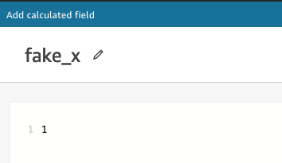
   7. Click "Save". You should now return to the main Analysis screen with the graphs
   8. Select the empty vertical bar chart graph
   9. In "Field wells", set the x-axis to "fake_x"
   10. Set the "Value" to "total_avg_response_time". When set, the aggregate function should default to "Count"
   11. [Following instructions outlined above](#change-aggregation) to change the aggregate for a value, change the aggregate function from "Count" to "Min"
   12. Add another copy/duplicate of "total*avg_response_time" to the graph's "Value" (by dragging "total_avg_response_time" to "Value" in "Field wells" again) \_beneath* the previous "total_avg_response_time (Min)" value, as shown in the figure below:
   13. 
   14. This time, change the aggregate function from "Count" to "Median"
   15. Repeat the above steps two more times: add two more "total_avg_reponse_time" values, set the first's aggregate to "Average", and set the second's to "Max". When finished, "Values" should have 4 "total_avg_response_time" values each with a different aggregate function. See figure below:
   16. 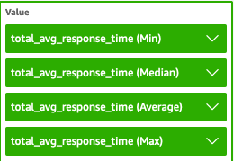
   17. Go to "Format visual" for the bar chart
   18. Un-collapse "X-axis" in "Format visual" by clicking on it
   19. Un-select every checkbox in the section: "Show title", "Show sort", "Show data zoom", "Show axis line", and "Show labels". The bar chart should now only display the y-axis
   20. Un-collapse "Legend"
   21. Un-select every checkbox in the section: "Show legend" and "Show legend title". The legend to the right of the bars in the vertical bar chart should no longer be visible
   22. Un-collapse "Data labels"
   23. Select "Show data labels". Each bar's value should now appear above their respective bar
   24. Un-collapse "Tooltip"
   25. Under "Display options", un-select "Use primary value as title" and _select_ "Show aggregations"
   26. Under "Fields", find "fake_x" and click on the three-dots to the right of its label. A dropdown menu should appear
   27. Click/select "Hide". The "fake_x" field should darken/grey-out. Now when hovering over each distinct bar in the bar chart you will see a tooltip showing the value and the corresponding aggregation function, as shown in the figure below:
   28. 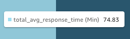
   29. Close the "Format visual" section by clicking the "x" button next to the name at the top of the section. The "Fields list" should re-appear
   30. <a id="set-ms-suffix"></a>In "Fields list", hover over "total_avg_response_time" until a vertical three-dots button appears to the right of the label. Click on it. A dropdown menu should appear
   31. Hover over "Format: 1,234.57". A dropdown menu should appear to the right
   32. Click on "More formatting options...". The "Fields list" section should be replaced with "Format data"
   33. Un-collapse the "Units" section
   34. In the input field labeled "Suffix", enter " ms". _Do not forget the leading space_. You should see the values in the vertical bar chart for "total_avg_response_time" update to include the new "ms" suffix
   35. Change the bar chart's title to "Total Average Response Time"
   36. Change the bar chart's subtitle to "Minimum, Median, Average, Maximum"
   37. Duplicate the bar chart following the [instructions for duplicating charts above](#duplicate-graph)
   38. For this new chart, change all of its aggregated values from "total_avg_response_time" to "total_reqs_per_second". You may need to change the aggregation function from "Count" to "Min"/"Median"/etc. after changing the value's field
   39. Change this new chart's title to "Total Requests Per Second"
   40. Ensure this new chart's subtitle is "Minimum, Median, Average, Maximum"
   41. Duplicate this new chart
   42. Change all aggregated values to "total_requests"
   43. Change the "total_requests" chart's title to "Total Requests"
   44. Ensure this new "total_requests" chart's subtitle is "Minimum, Median, Average, Maximum"
   45. Resize and move the 3 bar charts such that they are arranged at the top of the dashboard in a similar way to the following figure:
   46. 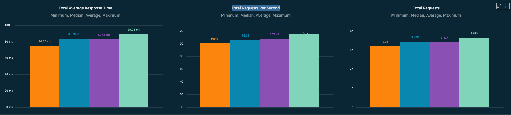

10. Next, recreate the comparison results pie chart

    1. Create a new visual [following the steps outlined above](#create-new-visual)
    2. In "Visual types" choose "Pie chart"
    3. Set the "Group/Color" in "Field wells" to "compare_result". The pie chart should update and show the ratios of each type of comparison result
    4. Rename the bottom-most label from "Group By: compare_result" to "Comparison Result"
    5. Change the title to "Comparison Results"

11. Finally, recreate the percentiles and average response time bar charts

    1. Add a new visual and set its type to "Vertical bar chart"
    2. Set the x-axis to "date_time"
    3. Set the values to "total_95_percentile", "total_99_percentile", "total_100_percentile". Ensure each value's aggregation function is "Sum". The bar chart should update and show each response time percentile for each date
    4. [Following the instructions outlined above](#sort-raw-timestamp), set "date_time"'s sort to "raw_timestamp" so that the graph is sorted by time
    5. [Following the instructions outlined above](#enable-data-labels), enable data labels such that the value of each bar in the bar chart is displayed above the bar
    6. [Following the instructions outlined above](#set-ms-suffix), _for each field in "Values"_ add a " ms" suffix to the field. The values displayed in the bar chart should now include a "ms" suffix to indicate that the value is a measure of time
    7. Change the chart's title to "95%, 99%, and 100% Total Response Time Percentiles over Time"
    8. Change the x-axis's title to "Date and Time (EST)"
    9. Duplicate the chart
    10. Change the chart's values to be "total_min_response_time", "total_median_response_time", and "total_max_response_time". Ensure each value's aggregation function is "Sum", not "Count". The bar chart should update and show each response time for each date
    11. [Following the instructions outlined above](#set-ms-suffix), change the suffix for "total_min_response_time" and "total_median_response_time" to " ms"
    12. Change the chart title to "Minimum, Median, and Average Response Times (ms) over Time"
    13. Ensure the x-axis title is "Date and Time (EST)"

12. <a id="set-sheet-title"></a>Click on "ADD" in the top-left
13. Select "Add title"
14. Set the sheet's title to "server-regression Statistics from TEST Environment 'master' Deployment Runs"
15. <a id="publish-dashboard"></a>On the top-right of the screen, click the share icon (next to the save and download icons). A dropdown menu should appear
16. Click "Publish dashboard"
17. Name the dashboard "bfd-test-server-regression"
18. Click "Publish dashboard". A new page should load showing the completed Dashboard
19. <a id="share-dashboard"></a>Click the share icon on the top-right of the screen. A dropdown menu should appear
20. Click "Share dashboard". A new page should load with sharing options
21. In the bottom right, under "Enable access for", select "Everyone in this account"
22. Select "Discoverable in QuickSight" as well
23. Close the Dashboard and return to the QuickSight "home" by clicking on "QuickSight" on the top-left of the screen
24. Return to the "Analyses" view
25. Open the "bfd-test-server-regression" analysis
26. <a id="save-copy-analysis"></a>When loaded, click on the save icon on the top-right of the screen. A dialog pop-up should appear titled "Save a copy"
27. In the input field, enter "bfd-prod-sbx-server-regression"
28. Click "SAVE". The copied Analysis should load
29. <a id="change-dataset"></a>In the left pane, click the pencil icon next to the "Dataset" label. A dialog pop-up should appear with the title "Datasets in this analysis"
30. Click on the vertical three-dots. A dropdown menu should appear
31. Click on "Replace". A new dialog should appear named "Select replacement dataset"
32. Select the "bfd-prod-sbx-server-regression" Dataset
33. Click "Select"
34. Click "Replace". All graphs in the Analysis should update appropriately with the new Dataset's field values
35. Change the sheet's title to "server-regression Statistics from PROD-SBX Environment 'master' Deployment Runs"
36. [Repeat the steps outlined above to publish](#publish-dashboard) and [share the Analsyis](#share-dashboard) as a Dashboard named "bfd-prod-sbx-server-regression"
37. [Repeat the previous steps](#save-copy-analysis) to duplicate the "bfd-prod-sbx-server-regression" Analysis. Name the duplicated analysis "bfd-prod-server-regression"
38. [Repeat the previous steps](#change-dataset) to replace the "bfd-prod-sbx-server-regression" Dataset with "bfd-prod-server-regression"
39. Change the sheet's title to "server-regression Statistics from PROD Environment 'master' Deployment Runs" [following instructions outlined above](#set-sheet-title)
40. [Repeat the steps outlined above to publish](#publish-dashboard) and [share the Analsyis](#share-dashboard) as a Dashboard named "bfd-prod-server-regression"

Once the steps above are complete, there should be three new Dashboards available to view in QuickSight
displaying performance metrics for each of the three environments (`TEST`, `PROD-SBX`, and `PROD`). These
Dashboards should appear similar to the following:

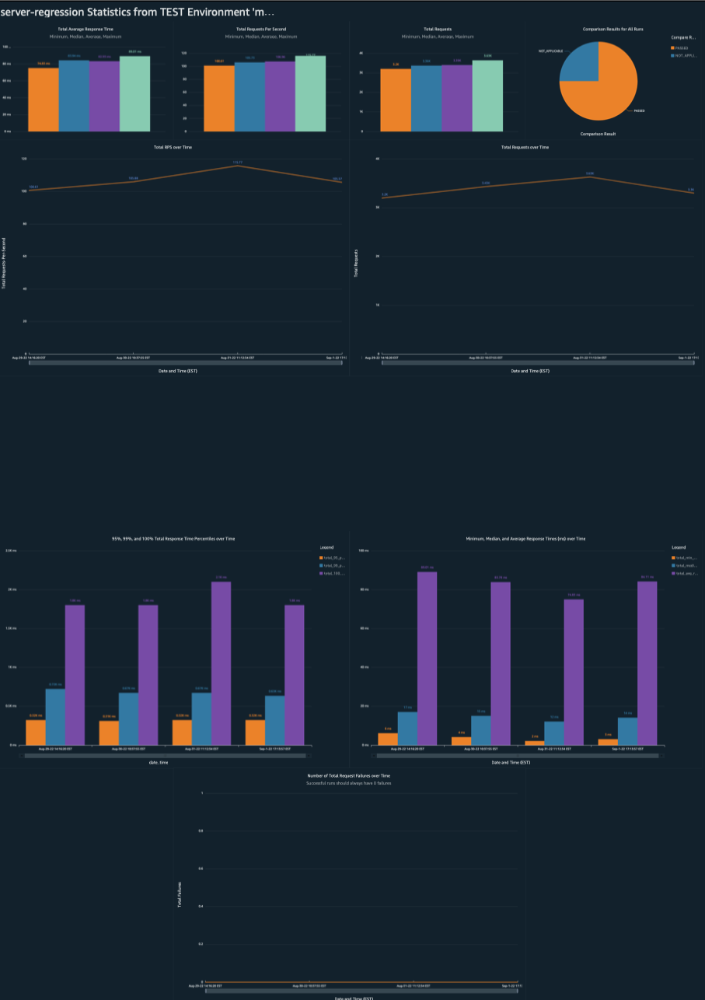
