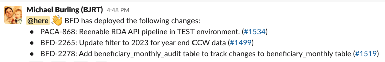

# How to Perform a BFD Deployment

Follow this runbook to successfully build and deploy the BFD Services code to target environment(s).

Note: If there are pending deployments or db migrations, make sure those finish before running these steps.

1. Access WEB-based CloudBees SDA Cloud Operations Center ```https://jenkins-east.cloud.cms.gov/bfd/``` and select BFD from the Dashboard.

2. A BFD build runs a series of ```Jenkins CI/CD``` pipeline steps, deploying to three environments: `PROD`, `PROD-SBX` and `TEST`. The pipeline includes a couple of fail-safes that, while optional, can be enabled to _lock_ environments before moving on to the next stage of the pipeline. To create an exclusive lock on one or more environments, select ```Lockable Resources``` from the left-side list of actions; the UI provides an interface where each environment can be locked by toggling its checkbox. Locking an environment precludes another build from deploying to the locked environment. 

3. From the list of Jenkins jobs, select the ```BFD Multibranch and Multistage Pipeline```.

4. Prior to initiating a build, one should confirm that the build environment has the most recent changes/updates to the codebase; on the left-side list of actions, select the ```Scan Repository Now``` to ensure latest changes are part of a build. After the ```Scan Repository Now``` has completed, verify that it matches up with Git's notion of ```master```. 

    - Beneath the `Scan Repository Now` link, select the `Scan Respository Log` link to view the pipeline's notion of what will be built. 
    - Look for `changes detected master`, and find the `git` hash for the latest `master` commit (example: ```Changes detected: master (null → 34a328cf9082bb7ab7bf640a632124ef59516f94)```).
    - Compare that `git hash` with the `git hash` found in the git repository for `master`; if the hash values match, you know that the pipeline will be building the latest `master`.

5. From either the ```Branches``` or the ```Pull Requests``` view (toggled via the selector at top of page), select the code branch to be built. For this exercse, we'll be building the latest changes to ```master``` so selecting ```master``` from within the ```branches``` page, displays a ```Stage View``` showing the last 10 builds.

6. Ensure no other jobs are currently building or queued up to build; it's also a good practice to check if another developer is performing work in the ```Test``` environment. This can be done by checking the ```Slack``` channel ```#bfd-builds```. If the ```Test``` environment is not clear, then one should either postpone the build, or contact the developer to see if they can relinqush their claim to the ```Test``` environment.

7. While not required, it is convenient to notify BFD developers of the intent to perform a deployment; this can be done by posting a message to the ```#bfd-builds``` Slack channel.
    - post message: ```/dibs on test``` to stake claim to the test enviornemnt.
    - post message: ```/dibs off test``` to release claim to the test enviornemnt.

8. From the ```Sate View``` for ```branch master```, select ```Build with Parameters``` link from the left-side displays a set of pipeline parameters that can be applied to the build:
    - `deploy_prod_from_non_master` : if enabled, deploy to prod-like envs for builds of this project's non-master branches.
    - `deploy_prod_skip_confirm` : if enabled, skips prompting for confirmation before deploying to most prod-like envs.
    - `build_platinum` : if enabled, build/update the _platinum_ base AMI; while no hard-fast rule for when to include this, an AMI is generally buit about once/week but can probably be skipped in most cases.
    - `use_latest_images` : if enabled, defer to latest available AMIs; skips `App` and `App Image` Stages.
    - `verbose_mvn_logging` : if enabled, `mvn` will produce verbose logs.
    - `skip_migrator_deployment` : if enabled, AND building a non-trunk or non-master branch, then do not deploy the migrator to the `test` environment.
    - `server_regression_image_override` : text input that can be used to identify/override the `Docker` image tag used when deploying the server-regression lambda.

9. Activate the pipeline processing using the ```Build``` button, which will include any parameters selected above.

10. When build commences, the ```Stage View``` is displayed showing the now activated current pipeline processing stage(s). If you need to see more detail of the pipeline build, then click the current build number (under ```Build History```). Some useful actions that provide more detailed information and control:
    - ```Console Output``` provides a detailed view of the console output log.
    - ```Pipeline Steps``` provides a dynamic hierarchial view of the pipeline stages.
    - ```Pause/resume``` allows you to stop (and restart) the pipeline processing.

11. When the build pipeline finishes the deployment to ```Test```, the pipeline may pause requesting a ```Manual Approval``` to proceed on to ```prod-sbx, prod```. This gives the operator a chance to abort further processing if needed.

12. When finished with a deploy from ```master```, there's a couple of _cleanup_ tasks that will need to be done:
    - notify ```#bfd-builds``` channel that you are releasing your hold on the ```Test``` environment as needed (```/dibs off test```).  
    - Notify folks that a deployment to ```Prod``` has been completed; this is done by posting a message to the `#bfd-users` _Slack_ channel. While there is no prescribed content of the message, a best practice is to list each title and URL link for the PRs that were merged into `master` for this deploy; for example:

