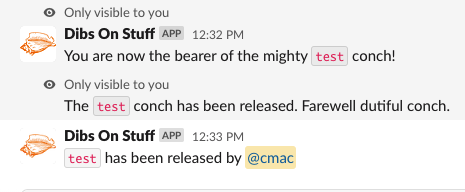
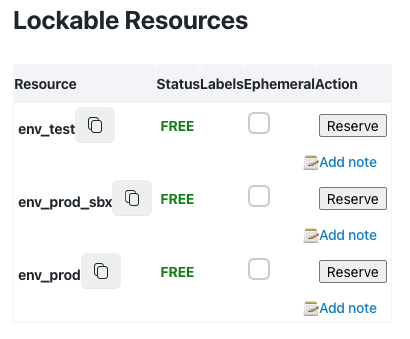
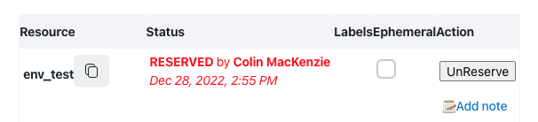
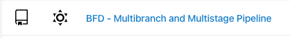
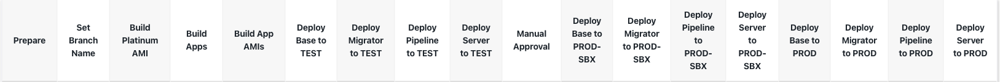
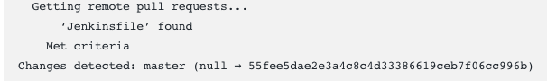
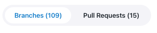
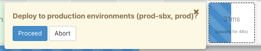
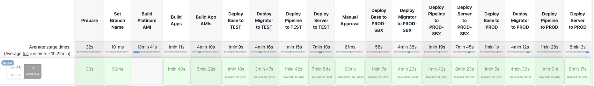
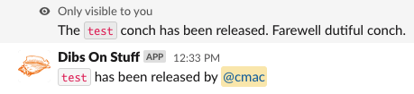

# How to Perform a BFD Deployment

Follow this runbook to successfully build and deploy BFD Services code to target environment(s).

Note: If there are pending deployments or db migrations, make sure those finish before running these steps.

## Background
#### Cloudbees SDA
The BFD build and deployment process is defined as a Continuous Integration (CI) component within a CloudBees SDA Cloud Operations Center (https://jenkins-east.cloud.cms.gov/bfd/). This CI workflow represents a software development process in which code changes can be automatically built, tested, and deployed.

In the BFD CI workflow, developers commit their code changes to a Git branch; these changes can then be built and tested using the CloudBees Jenkins CI server. If all tests pass, the code may be automatically deployed into one or more BFD target environments.

The standard build stream, `_BFD Multi-Branch and Multi-Stage Pipeline_`, is made up of a series of steps or stages; each stage performs some operation within the pipeline; a successful completion of a stage initiates a subsequent pipeline stage. A failed step at any point results in termination of the pipeline job; it is also possible for an operator to interrupt a build pipeline job using the CloudBees Web interface.

#### BFD Target Environemnts
BFD target environments are: `_Test_`, `_Production Sandbox_`, and `_Production_`; each environment is built, tested and deployed based on a combination of factors such as build arguments, sensitive and non-sensitive environment parameters (`_AWS SSM Paramter Store_`) and operator interaction.

A complete pipeline run encapsulates building and deploying to each of the three BFD environments; the order of operation is:
- `Test (test)`
- `Production Sandbox (prod-sbx)`
- `Production (prod)`

However, in some cases, it may not be desirable to deploy to all environments; for example, a developer only wants to deploy a branch to Test for some isolated testing. The pipeline accomplishes this through a combination of the CloudBees Web user interface and a built-in pipeline fail-safe that halts the pipeline after building and deploying to Test.

#### CloudBees Web UI
The CloudBees Managed Controller web user interface (UI) is how a BFD deployment is initiated; the UI lists assorted pipeline configurations. The pipeline job configuration that is relevant here is the `BFD - Multibranch and Multistage Pipeline` which encapsulates all the necessary steps to build and deploy BFD services to its three environments.

1. Ensure that no other jobs are currently building or queued up to build; in addition, one should check if another developer is performing work/testing in the `Test` environment.
To do so, one can attempt to notify other developers that you will be initiating a build by posting a message to the `Slack` channel `#bfd-builds`:
    - post message: `/dibs on test` to stake your claim on the test enviornemnt.

    
If you are not able to stake your claim to the `Test` environment, it would mean that another developer has it reserved for their build and/or testing. In that scenario one would probably not proceed unless `Test` is available; the prudent move here is to reach out to the developer to see if they are able to relinquish their reservation of the `Test` environment.

2. From browser navigate to CloudBees Managed Controller: https://jenkins-east.cloud.cms.gov/bfd/

3. The `Managed Controller` page for BFD provides a list of build configurations available in the CloudBees Jenkins server. 

`OPTIONAL`:
Prior to moving on to next step(s) associated with the BFD Pipeline, it is recommended that you consider locking target environment(s) to preclude an unintended deployment or another build from over-writing your planned deployment.
    - On the left-side list of operations, near the bottom is an item `Lockable Resources`.
    
    - selecting the `Lockable Resources` brings up a small dailog box that allows you to lock one or more of the BFD environments.
     
    - use the `env_test` `Reserve` button to create a exclusive deployment lock on the `Test` environment.
     

This notion of locking an environment will likely be going away as determined by future work in the Jenkins enviroment. 

4. Select a Jenkins job configuration to be used for the deployment; for a standard BFD build/deployment, select the `BFD - Multibranch and Multistage Pipeline` link.

     

The name `Multistage Pipeline` suggests a series of tasks will be executed; of primary interest are the target environments for a deployment:
- build and deploy to the `test` environment.
- build and deploy to the `prod-sbx` environment.
- build and deploy to the `prod` environment.

There are some optional pipeline tasks such as a doing an AMI build, that can be included in the pipeline stages based on operator specified parameters. In addition there are pipeline fail-safes that require operator intervention to proceed to the next stage; for example, to proceed from `test` to `prod-sbx` build/deploy, the operator may be asked to respond to a `Proceed` dialog button.

`Pipeline Stage View` (as of 31-DEC-2022):

5. Prior to initiating a build, one should confirm that the build environment has the most recent changes/updates to the codebase; on the left-side list of actions, select the `Scan Repository Now` to ensure latest changes are part of a build.

    
After the Scan Repository has completed, verify that it matches up with Git's notion of `master`. Just below the `Scan Repository Now` link, select the `Scan Respository Log` link to view the pipeline's notion of what will be built. Look for the _changes detected master_ line, and find the `git` hash of the latest `master` commit.

    
Compare that with the git hash found in the git repository for `master` (whatever tool you use):
    
 If the hash values match, you know that the pipeline will be building the latest `master`.

6. Select the source of the code to be built; this will be either `Branches` or `Pull Requests`.

    

7. Within either the `Branches` page or the `Pull Requests` page, select the appropriate code branch or PR for deployment. For this exercise, since we are building `master` and deploying to all environments, select the branch `master` from the list of branches (`Branches` page).

8. The `Branch master` page is displayed, showing the pipeline's previous 10 runs and average stage processing times. Selecting the `Build with Parameters` from the left-side tasks list, displays a set of pipeline parameters that can be applied to the build:
    - `deploy_prod_from_non_master` : if enabled, deploy to prod-like envs for builds of this project's non-master branches.
    - `deploy_prod_skip_confirm` : if enabled, skips prompting for confirmation before deploying to most prod-like envs.
    - `build_platinum` : if enabled, build/update the _platinum_ base AMI.
    - `use_latest_images` : if enabled, defer to latest available AMIs; skips `App` and `App Image` Stages.
    - `verbose_mvn_logging` : if enabled, `mvn` will produce verbose logs.
    - `skip_migrator_deployment` : if enabled, AND building a non-trunk or non-master branch, then do not deploy the migrator to the `test` environment.
    - `server_regression_image_override` : text input that can be used to identify/override the `Docker` image tag used when deploying the server-regression lambda.

    Since in this example, we are building `master` and deploying to all environments, we can accept all defaults (nothing enabled) and proceed; to activate the pipeline, select the `Build` button at the bottom of the page.

9. When build commences, the `Stage View` is displayed showing the now activated current pipeline processing stage(s). If you wish to see more detail of the pipeline build, then click the current build number (under `Build History`). Some useful actions that provide more detailed information and control:
    - `Console Output` provides a detailed view of the console output log.
    - `Pipeline Steps` provides a dynamic hierarchial view of the pipeline stages.
    - `Pause/resume` allows you to stop (and restart) the pipeline processing.

10. When the build pipeline completes the deployment to `Test` stage, the pipeline processing may pause at the `Manual Approval` step and a small dialog appears:

    
This gives you the opportunity to do things like perform testing vs the `test` deployment, or you can just continue pipeline processing by hitting the `Proceed` button; the pipeline processing resumes continuing on to deploy `prod-sbx` and then to deploy `prod`. A successfully completed pipeline deployment looks like:
    
12. When finished with build, there's a couple of _cleanup_ tasks that will need to be done:
- if you created a hold on `test` (Step 1), you'll need to release your reservation:
    - notify #bfd-builds channel that you are releasing your hold on the `Test` enviornment.
    - post message: `/dibs off test` to unreserve the test enviornemnt.
    
- Next you need to notify folks of the fact that a deployment has been completed; this is done by posting a message to the `#bfd-users` _Slack_ channel. While there is no prescribed content of the message, a best practice is to list each title and URL link for the PRs that were merged into `master` for this deploy; for example:

## FAQ
#### What happens if I am unable to lock `Test` for a deployment?
Unable to lock `Test` prior to initiating a build, is not necessarily a show-stopper, but does introduce a situation that should be resolved prior to starting the build. Things like:
- Is someone else running a build?
- Has someone reserved `test` because they are actively testing something?

Ultimately a build/deploy represents a finite resource (deployment) that will overwrite environments that may cause angst to other developers...`ceteris paribus`.
#### What happens if my deployment includes a `flyway migration` script?
This one is a little tricky in that it is important to understand what happens when the deployment completes:
Post-deployment means that the `BFD Migrator` will attempt to process all `flyway` migration scripts; if your deployment includes any `flyway` scripts not yet applied to the target environment database (i.e. `test`), then the migrator will apply those migration scripts to the database; this changes the database for all users and subsequent testing!

 This is potentially a destructive operation in that once applied, should only be undone by another `flyway` script (or ask one of the other developers the best way to remediate the situtation).