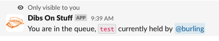

# How to Perform a BFD Deployment

Follow this runbook to successfully build and deploy BFD Services code to target environment(s).

Note: If there are pending deployments or db migrations, make sure those finish before running these steps.

## Background
#### Cloudbees SDA
The BFD build and deployment process is defined as a Continuous Integration (CI) component within a CloudBees SDA Cloud Operations Center (https://jenkins-east.cloud.cms.gov/bfd/). This CI workflow represents a software development process in which code changes can be automatically built, tested, and deployed.

In the BFD CI workflow, developers commit their code changes to a Git branch; these changes can then be built and tested using the CloudBees Jenkins CI server. If all tests pass, the code is automatically deployed into one or more BFD target environments.

The standard build stream, `_BFD Multi-Branch and Multi-Stage Pipeline_`, is made up of a series of steps or stages; each stage performs some operation within the pipeline; a successful completion of a stage initiates a subsequent pipeline stage. A failed step at any point results in termination of the pipeline job; it is also possible for an operator to interrupt a build pipeline job using the CloudBees Web interface.

#### BFD Target Environemnts
BFD target environments are: `_Test_`, `_Production Sandbox_`, and `_Production_`; each environment is built, tested and deployed based on a combination of factors such as build arguments, sensitive and non-sensitive environment parameters (`_AWS SSM Paramter Store_`) and operator interaction.

A complete pipeline run encapsulates building and deploying to each of the three BFD environments; the order of operation is:
- `Test (test)`
- `Production Sandbox (prod-sbx)`
- `Production (prod)`

However, in some cases, it may not be desirable to deploy to all environments; for example, a developer only wants to deploy a branch to Test for some isolated testing. The pipeline accomplishes this through a combination of the CloudBees Web user interface and a built-in pipeline fail-safe that halts the pipeline after building and deploying to Test.

#### CloudBees Web UI
The CloudBees Managed Controller web user interface (UI) is how a BFD deployment is initiated; the UI lists assorted pipeline configurations. The pipeline job configuration that is relevant here is the `BFD - Multibranch and Multistage Pipeline` which encapsulates all the necessary steps to build and deploy BFD services to its three environments.

1. Ensure that no other jobs are currently building or queued up to build.

2. From browser navigate to CloudBees Managed Controller: https://jenkins-east.cloud.cms.gov/bfd/

3. The `Managed Controller` page for BFD provides a list of build configurations available in the CloudBees Jenkins server. Prior to moving on to next step(s) associated with the BFD Pipeline, it is recommended that you consider locking target environment(s) to preclude an unintended deployment or another build from over-writing your planned deployment.
    - On the left-side list of operations, near the bottom is an item `Lockable Resources`.
    
    - selecting the `Lockable Resources` brings up a small dailog box that allows you to lock one or more of the BFD environments.
     
    - use the `env_test` `Reserve` button to create a exclusive deployment lock on the `Test` environment.
     

4. In addition to creating a lock within the build environment, a _BFD Team_ best practice is to notify other team members via the `Slack` channel `#bfd-builds`, that you intend to deploy to the Test environment.
    - post message: `/dibs on test` to stake your claim on the test enviornemnt.

    
If you are not able to successfuly stake your claim to the `Test` environment, it would mean that another developer has it reserved for their build and/or testing. In that scenario you should not proceed since any deployment will effectively alter the `test` environment.

5. Select a Jenkins job configuration to be used for the deployment; for a standard BFD build/deployment, select the `BFD - Multibranch and Multistage Pipeline` link.

     

The name `Multistage Pipeline` suggests a series of tasks will be executed; of primary interest are target environments for a deployment:
- build and deploy to the `test` environment.
- build and deploy to the `prod-sbx` environment.
- build and deploy to the `prod` environment.

There are some optional pipeline tasks such as a doing an AMI build, that can be included in the pipeline stages based on operator specified parameters. In addition there are pipeline fail-safes that require operator intervention to proceed to the next stage; for example, to proceed from `test` to `prod-sbx` build/deploy, the operator may be asked to respond to a `Proceed` dialog button.

`Pipeline Stage View` (as of 31-DEC-2022):

6. Prior to initiating a build, one should confirm that the build environment has the most recent changes/updates to the codebase; on the left-side list of actions, select the `Scan Repository Now` to ensure latest changes are part of a build.

    

7. Select the source of the code to be built; this will be either `Branches` or `Pull Requests`.

    

8. Within either the `Branches` page or the `Pull Requests` page, select the appropriate code branch or PR for deployment. For this exercise, assume we are building the `master` branch and deploying to all environments; select the branch `master` from the list of branches (`Branches` page).

9. The `Branch master` page is displayed, showing the pipeline's previous 10 runs and average stage processing times. Selecting the `Build with Parameters` from the left-side tasks list, displays a set of pipeline parameters that can be applied to the build:
    - `deploy_prod_from_non_master` : if enabled, deploy to prod-like envs for builds of this project's non-master branches.
    - `deploy_prod_skip_confirm` : if enabled, skips prompting for confirmation before deploying to most prod-like envs.
    - `build_platinum` : if enabled, build/update the _platinum_ base AMI.
    - `use_latest_images` : if enabled, defer to latest available AMIs; skips `App` and `App Image` Stages.
    - `verbose_mvn_logging` : if enabled, `mvn` will produce verbose logs.
    - `skip_migrator_deployment` : if enabled, AND building a non-trunk or non-master branch, then do not deploy the migrator to the `test` environment.
    - `server_regression_image_override` : text input that can be used to identify/override the `Docker` image tag used when deploying the server-regression lambda.

    Since in this example, we are building `master` and deploying to all environments, we can accept all defaults (nothing enabled) and proceed; to activate the pipeline, select the `Build` button at the bottom of the page.

10. When build commences, the `Stage View` is displayed showing the now activated current pipeline processing stage(s). If you wish to see more detail of the pipeline build, then click the current build number (under `Build History`). Some useful actions that provide more detailed information and control:
    - `Console Output` provides a view of the console output log.
    - `Pipeline Steps` provides a dynamic hierarchial view of the pipeline stages.
    - `Pause/resume` allows you to stop (and restart) the pipeline processing.

11. 

12. When finished with build, notify #bfd-builds channel that you are releasing your hold on the `Test` enviornment.
    - post message: `/dibs off test` to unreserve the test enviornemnt.

    

## FAQ
#### What happens if I am unable to lock `Test` for a deployment?
Unable to lock `Test` prior to initiating a build, is not necessarily a show-stopper for your build, but does preclude the build from actually deploying to `Test`. If the goal is to simply do a build without actually deploying, then you can proceed without undue problems.

A second part of this response relates to the non-binding `/dibs on Test` which is simply an indicator that a developer wishes to reserve the `Test` enviroment for testing. If you attempt to perform the `/dibs` and you get a message that another developer has already laid claim to the `Test` environment:
    
In that scenario you are basically waiting in a queue for `Test` to be released:
- You can either reach out to the developer who holds the `test conch` and see if they will release their reservation.
- Simply wait until any reservation(s) have been released before proceeding.

#### What happens if my deployment includes a `flyway migration` script?
This one is a little tricky in that it is important to understand what happens when the deployment completes:
1. Post-deployment means that the `BFD Migrator` will attempt to process all `flyway` migration scripts; if your deployment includes any `flyway` scripts not yet applied to the target environment database (i.e. `test`), then the migrator will apply those migration scripts to the database; this changes the database for all subsequent testing!

 This is potentially a destructive operation 

in that once applied, can only be undone by another `flyway` script.