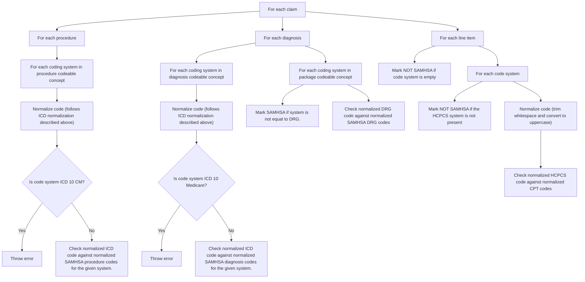
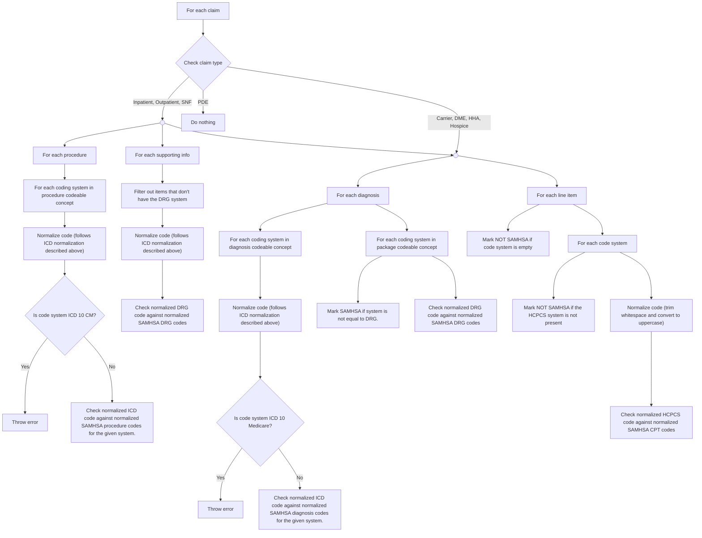

# CSV files

SAMHSA codes to check against are loaded from CSV files.
These files are normalized with the following rules.

## DRG Codes
- Trim whitespace
- Remove "MS-DRG " prefix
- Result is just the numeric value. ex: "897"

## CPT Codes
- Trim whitespace
- Convert to uppercase
- Result is alphanumeric string. ex: "T1006"

## ICD 9 Procedure Codes
- Trim whitespace
- Remove first decimal point
- Convert to uppercase
- Result is numeric string. ex: "9445"

## ICD 9 Diagnosis Codes
- Trim whitespace
- Remove first decimal point
- Convert to uppercase
- Result is numeric string. ex: "30410"

## ICD 10 Procedure Codes
- Trim whitespace
- Remove first decimal point
- Convert to uppercase
- Result is alphanumeric string. ex: "HZ53ZZZ"

## ICD 10 Diagnosis Codes
- Trim whitespace
- Remove first decimal point
- Convert to uppercase
- Result is alphanumeric string. ex: "F16188"

## Coding URLS
These URLs are what it checks against to match the type of code
- ICD 9: `http://hl7.org/fhir/sid/icd-9-cm`
- ICD 9 Medicare: `http://www.cms.gov/Medicare/Coding/ICD9`
- ICD 10: `http://hl7.org/fhir/sid/icd-10`
- ICD 10 CM: `http://hl7.org/fhir/sid/icd-10-cm`
- ICD 10 Medicare: `http://www.cms.gov/Medicare/Coding/ICD10`
- DRG: `https://bluebutton.cms.gov/resources/variables/clm_drg_cd`

# Checks for PAC data

# Checks for EOB

